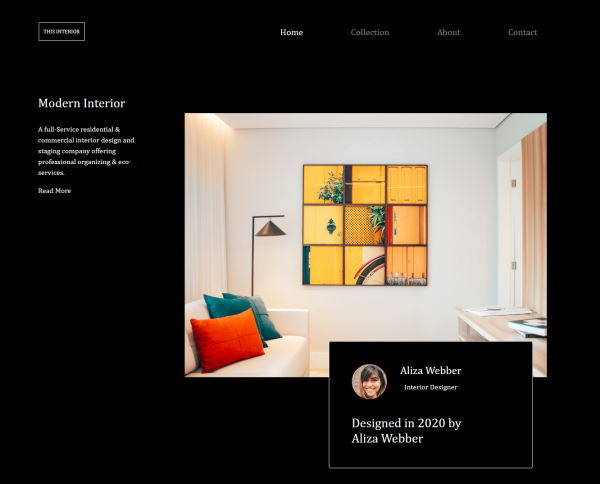

<!-- Please update value in the {}  -->

<h1 align="center">Interior Design Page</h1>

   Solution for a challenge from  <a href="http://devchallenges.io" target="_blank">Devchallenges.io</a>.

  <h3>
    <a href="https://codewriting.dev/100daysofcode/day13">
      Demo
    </a>
     | 
    <a href="https://codewriting.dev/100daysofcode/day13">
      Solution
    </a>
     | 
    <a href="https://devchallenges.io/challenges/Jymh2b2FyebRTUljkNcb">
      Challenge
    </a>
  </h3>

<!-- TABLE OF CONTENTS -->

## Table of Contents

- [Overview](#overview)
  - [Built With](#built-with)
- [Features](#features)
- [Contact](#contact)
- [Acknowledgements](#acknowledgements)

<!-- OVERVIEW -->

## Overview

Introduce your projects by taking a screenshot or a gif. Try to tell visitors a story about your project by answering:

- You can see this demo at the above link
- I feel like I spent most of my time getting the layout just right.
- I have learned more about material ui.
- It takes some effort to get things aligned properly, but keep at it

### Built With

<!-- This section should list any major frameworks that you built your project using. Here are a few examples.-->

- [Bootstrap](https://getbootstrap.com/)
- [Material UI](https://material-ui.com/)

## Features

<!-- List the features of your application or follow the template. Don't share the figma file here :) -->

This page was created as a submission to a [DevChallenges](https://devchallenges.io/challenges) challenge. The [challenge](https://devchallenges.io/challenges/Jymh2b2FyebRTUljkNcb) was to build a page layout to complete the given user stories.

## Acknowledgements

<!-- This section should list any articles or add-ons/plugins that helps you to complete the project. This is optional but it will help you in the future. For example -->

- [Steps to replicate a design with only HTML and CSS](https://devchallenges-blogs.web.app/how-to-replicate-design/)

## Contact

- Website [codewriting.dev](https://codewriting.dev)
- GitHub [@flyboy85749](https://github.com/flyboy85749)
- Twitter [@WebDev_Bill](https://twitter.com/WebDev_Bill)
