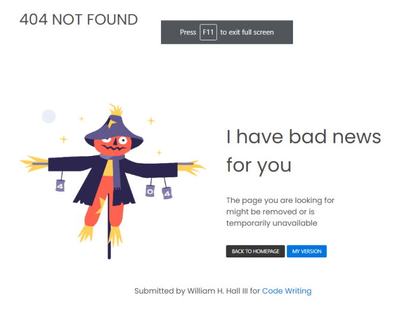
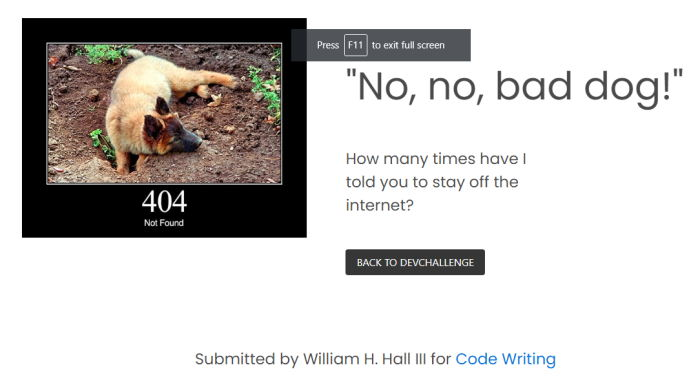

<!-- Please update value in the {}  -->

<h1 align="center">404 Page Challenge</h1>

   Solution for a challenge from  <a href="http://devchallenges.io" target="_blank">Devchallenges.io</a>.

  <h3>
    <a href="https://codewriting.dev/100daysofcode/day8/">
      Demo
    </a>
     | 
    <a href="https://codewriting.dev/100daysofcode/day8/">
      Solution
    </a>
     | 
    <a href="https://devchallenges.io/challenges/wBunSb7FPrIepJZAg0sY">
      Challenge
    </a>
  </h3>

<!-- TABLE OF CONTENTS -->

## Table of Contents

- [Overview](#overview)
  - [Built With](#built-with)
- [Features](#features)
- [Contact](#contact)
- [Acknowledgements](#acknowledgements)

<!-- OVERVIEW -->

## Overview

Introduce your projects by taking a screenshot or a gif. Try to tell visitors a story about your project by answering:

- Check out my demo at the above link
- This was a lot of fun, especially using the http dogs image
- I learned that 404 pages are needed to create a good user experience
- You can't get there from here ?

### Built With

<!-- This section should list any major frameworks that you built your project using. Here are a few examples.-->

- [Bulma](https://bulma.io)

## Features

<!-- List the features of your application or follow the template. Don't share the figma file here :) -->

This page was created as a submission to a [DevChallenges](https://devchallenges.io/challenges) challenge. The [challenge](https://devchallenges.io/challenges/wBunSb7FPrIepJZAg0sY) was to build a 404 error page, with the given layout.

## Acknowledgements

<!-- This section should list any articles or add-ons/plugins that helps you to complete the project. This is optional but it will help you in the future. For example -->

- [Steps to replicate a design with only HTML and CSS](https://devchallenges-blogs.web.app/how-to-replicate-design/)

## Contact

- Website [codewriting.dev](https://codewriting.dev)
- GitHub [@flyboy85749](https://github.com/flyboy85749)
- Twitter [@WebDev_Bill](https://twitter.com/WebDev_Bill)
