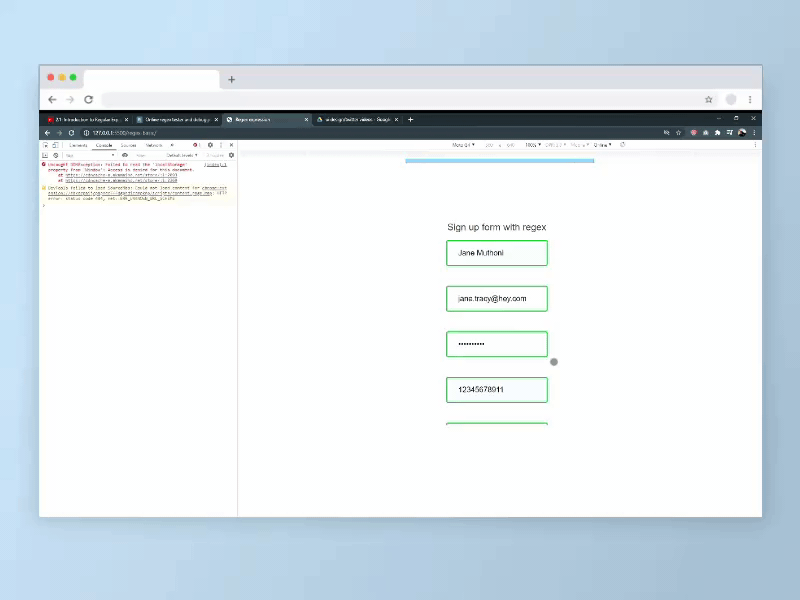
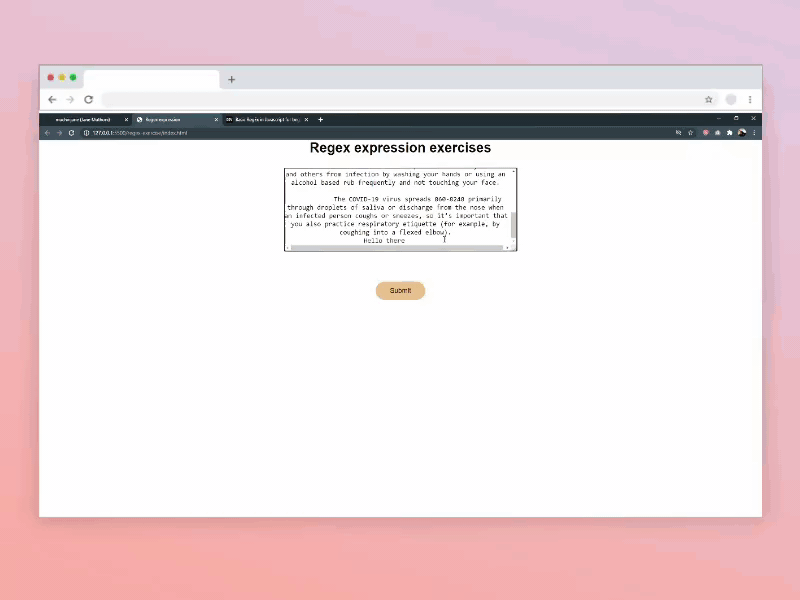
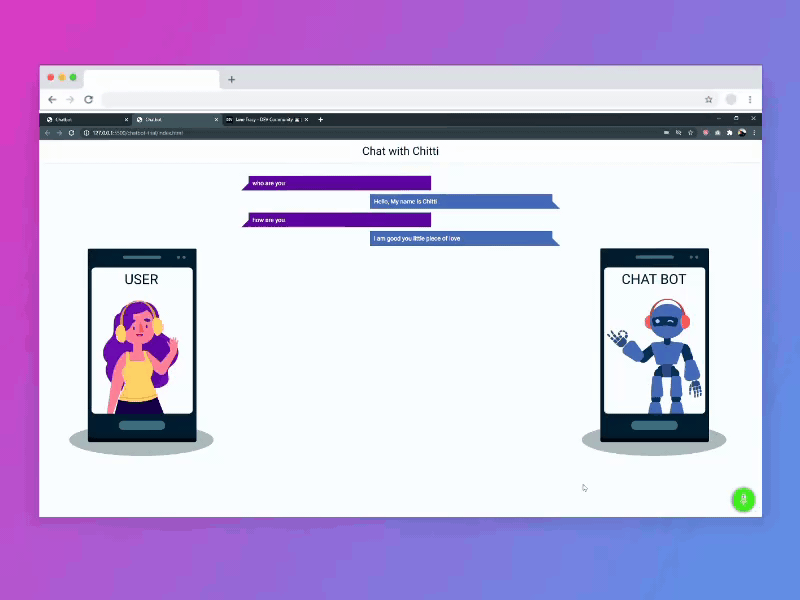

# 100 Days Of Code - [Dev blog artices](https://dev.to/janetracydev)

#### My social media platform

[Twitter](https://twitter.com/TracyCss "Follow me on Twitter")  
[CodePen](https://codepen.io/tracey_jane "Follow me on CodePen or check out my pens")  
[GitHub](https://github.com/muchirijane "Follow me om GitHub or check out my projects")  
[Dev Community Blog](https://dev.to/janetracydev "Follow me and  check out my posts")

## Welcome to my journey!

[100daysofcode.com](https://100daysofcode.com) &bull; [#100DaysOfCode](https://twitter.com/hashtag/100DaysOfCode) &bull; [@ka11away](https://twitter.com/ka11away)

### My Goals

At the end of this challenge i would love to have learnt the following:

- Gsap Animation
- Object Oriented Programming in JS
- Create more front-end websites
- Learn Vue/react js
- Node Js
- Improve in refactoring code and degugging

This are the sections I am going to focus on to improve my front end skills. I hope during or by the end of the challange I will have a job in front end development or freelancing.

### Contents

* [Rules](rules.md)
* [FAQ](FAQ.md)
* [Resources](resources.md)

---

### Day 1:  
##### Create a blog post about Git and Github for beginners

**Today's Progress**: I have always wanted to understand the basic git commands. This made me do more reading about it and make notes on it

**Task Accomplished:** After going through different documents on the internet, watching videos on Youtube i finally got the git and github basics. 
                       Since i have nver created a tech post,I created one on this topic. 
  

**Link to work:** [Git and Github for beginners on dev blog](https://dev.to/tracycss/git-and-github-for-beginners-po3)

**Tweet:** https://twitter.com/TracyCss/status/1274346856387141636

---

### Day 2
##### Pull request and my first contribution

**Today's Progress**: I always wanted to know how to do pull request and contribute to projects on Github.

**Task Accomplished:** I went ahead to do my research on youtube and I was able to do my first simple contribution to the Github community.

**Results:** In the blog I created I made a bonus section on how to do a pull request and a quick guide to open source contribution.

**Tweet:** https://twitter.com/TracyCss/status/1275057548131856384

**Link to my blog:**
- [Blog post](https://dev.to/tracycss/git-and-github-for-beginners-po3)

---

### Day 3
##### Learning boostarp 5 alpha 1

**Today's Progress**: I decided to learn about boostrap 5 and it's components.

**Task Accomplished:** I was able to create different components like navbar forms and the new grid system.

**Results:** I created a simple website which I also designed it with Balsamiq desktop app.

**Tweet:** https://twitter.com/TracyCss/status/1275057548131856384

**Link to my blog:**
- [Githut repository](https://github.com/muchirijane/boostrap-5-website)

---

### Day 4
##### Getting started with Gsap animation

**Today's Progress**: I started going through the Gsap documentation to know how to use it in both logos and images

**Task Accomplished:** I was able to learn how to use animations in images and create different timing durations.

**Results:** I started coding an amazing websited designed by [Shamima Nasrin](https://dribbble.com/shamimanasrin?ref=uistore.design). I used Gsap to create the amazing       animations

**Tweet:** https://twitter.com/TracyCss/status/1276560015395094529

---

### Day 5
##### Getting started with Gsap animation

**Today's Progress**: I continued going through the Gsap documentation to know how to use to make stagger animation.

**Task Accomplished:** I was able to learn how to use rotation animation in images and create different timing durations.

**Results:** I continued coding the amazing websited designed by [Shamima Nasrin](https://dribbble.com/shamimanasrin?ref=uistore.design).
             I used Gsap to create the amazing  animations

**Tweet:** https://twitter.com/TracyCss/status/1276560015395094529

---

### Day 6
##### Getting started with Gsap animation

**Today's Progress**: I continued going through the Gsap documentation to know how to use to make stagger animation.

**Task Accomplished:** I was able to learn how to use rotation and scale animation in images and create different timing durations.

**Results:** I continued coding the amazing websited designed by [Shamima Nasrin](https://dribbble.com/shamimanasrin?ref=uistore.design).
             I used Gsap to create the amazing  animations

**Tweet:** https://twitter.com/TracyCss/status/1277547377658933253

---

### Day 7
##### Getting started with Gsap animation

**Today's Progress**: I continued going through the Gsap documentation to know how to use to make stagger animation.

**Task Accomplished:** I was able to learn how to use scale and position animation(x and y) in images and create different timing durations.

**Results:** I continued coding the amazing websited designed by [Shamima Nasrin](https://dribbble.com/shamimanasrin?ref=uistore.design).
             I used Gsap to create the amazing  animations

**Tweet:** https://twitter.com/TracyCss/status/1277873031004684288

---

### Day 8
##### Getting started with Regex in javascript

**Today's Progress**: I started learning about regex syntax and how to work with it to validate forms.

**Task Accomplished:** I was able to understand regex syntax and how it operates in JavaScript. Getting to know about single characters, the greedy characters and the quantifiers. 

**Results:** I was able to create a simple login in form that has validation with the help of regex characters.

**Tweet:** https://twitter.com/TracyCss/status/1278316219968479232

[💻 Github source files](https://github.com/muchirijane/regex-basic)  
[🎥 Live preview](https://muchirijane.github.io/regex-basic/)

**Update:** My Git and Github for beginners post got in the top 7 post in Dev community and also got the Git badge. Totally amazing for my first tech blog article to get this far.

---

### Day 9 - 10
#####  Regex expression in javascript

**Today's Progress**: I continued learning about regex syntax and how to work with it in code editors or strings in inputs.

**Task Accomplished:** I was able to get to know how to a string and group it into individual groups with regex pattern.

**Results:** I was able to code a fun project where text value from the textarea is converted into span tags that you can hover over and they change their background color.

**Tweet:** https://twitter.com/TracyCss/status/1278964521613303808

[📜 Github source files](https://github.com/muchirijane/regex-word-generator)  
[🎥 Live Preview ](https://muchirijane.github.io/regex-word-generator/)

---

### Day 11
#####  Regex expression in javascript

**Today's Progress**: After learn about regex expression and how it's applied in forms, card validation and other areas.

**Task Accomplished:** Learn more about regex and write an artcle.

**Results:** I was able to publish my second tech post about Regex expression in Javascript for beginners. This is a deep drive of regex,, it's aplication and resources to use to learn it.

**Tweet:** https://twitter.com/TracyCss/status/1279770095225647104

**Dev Post:** [✍ Regex expression in Javascript for beginners](https://dev.to/tracycss/basic-regex-in-javascript-for-beginners-1dnn)

---

### Day 12 - 13
#####   Web speech API in javascript

**Today's Progress**: Started learning about speech recognition and speech synthesis.

**Task Accomplished:** I was able to go through Mozilla developer documentation about Web Speech API and build their examples as I learn.

**Results:** I was able to publish my second tech post about Regex expression in Javascript for beginners. This is a deep drive of regex,, it's aplication and resources to use to learn it. I found a git repo from coding curry and I also used it in my learning process.

**Tweet:** https://twitter.com/TracyCss/status/1281474098326114305

[📜 Github source files ](https://github.com/muchirijane/chat-trial)  
[🎥  Live Preview ](https://muchirijane.github.io/chat-trial/)

---

