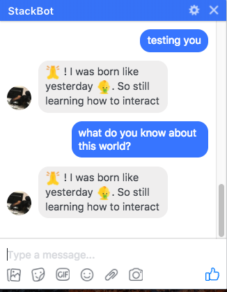
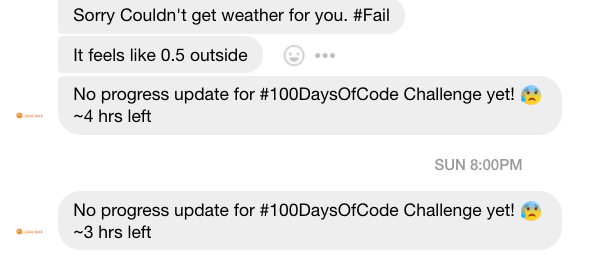
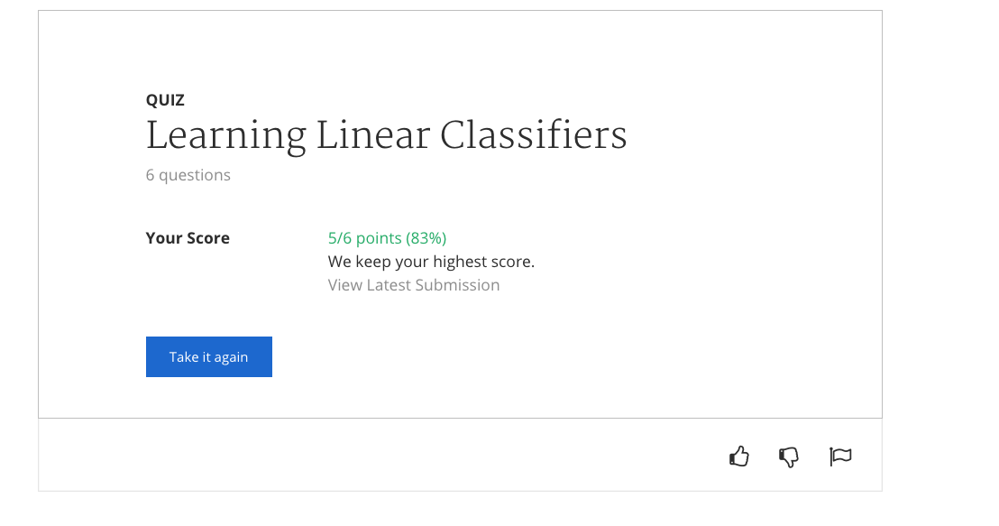
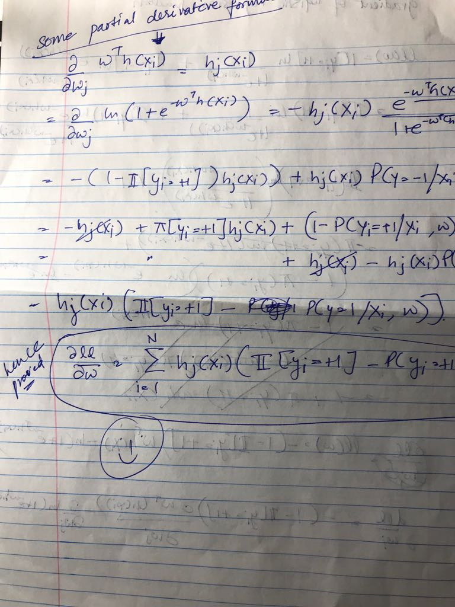
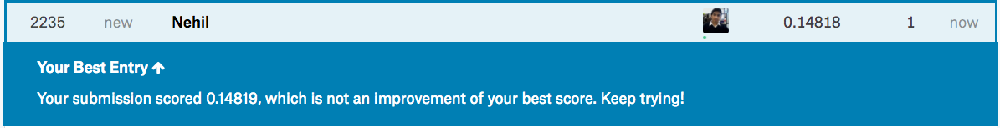
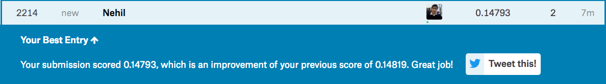
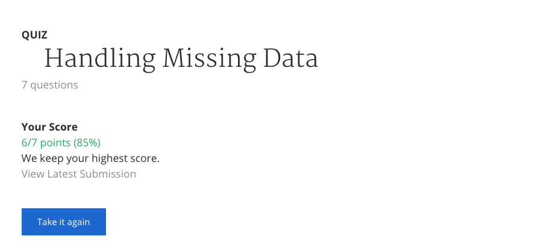

# 100 Days Of Code - Log

### Day 1: Jan 18, 2018

**Today's Progress**:

- Started setting up the lambda server for brain of my bot.
- Created an endpoint to return true or false if progress log.md (this file) was updated with today's progress.

**Thoughts:** Setup Python3 env, Zappa and basic Flask App. Feels like it took 1.5 hrs to just setup and play with simple github API, need to improve my speed. Refactored logic and simplified requirements in second pass

**Link to work:**

- [API endpoint:=> /brain/api/v1.0/logs/is_updated_today](https://6kvjel14vk.execute-api.us-east-1.amazonaws.com/dev/brain/api/v1.0/logs/is_updated_today)

### Day 2: Jan 19, 2018

**Today's Progress**:

- Created webhook for messenger bot to talk to
- Connected messenger bot to api, simple bot set-up

**Thoughts:** Need to spend more time reading fb messenger api. Should not be that hard. Github example repo was super helpful to quickly get things up and running. Will need to refactor brain.py soon.

**Link to work:**

### Day 3: Jan 20, 2018

**Today's Progress**:

- Refactored code, more to go
- Fixed Timezone bug
- Added notification for no progress update

**Thoughts:** Need to start writing tests. Weekends should be heavier than couple 100 lines of push. Push Push Push!!

**Link to work:** Nothing to show yet

### Day 4: Jan 21, 2018

**Today's Progress**:

- Refactored logging code, more to go
- Bot notifies me if the weather is very cold (feels like < -10) or plesant in winter (feels like > 0)
- New Name, New Logo

**Thoughts:** Need to start writing tests. Push Push Push to write heavier pieces!!

**Link to work:** 

### Day 5: Jan 22, 2018

- Solved Programming assignment for [Classification Course](https://www.coursera.org/learn/ml-classification)
- Warming up to sklearn functions and skills

**Thoughts:** Making and evaluating simple baseline models is quite easy. I should practice it more often. That way I will not have to relearn the scipy api over and over again.

**Link to work:** 

### Day 6: Jan 23, 2018

- Completed Assignment 1 and Quiz
- Started on Hypothesis Testing

**Thoughts:** Working throught it

**Link to work:** 

### Day 7: Jan 24, 2018

- Completed creating Feature Matrix for Assignment 1 Week 2
- Added security for APIGateway Endpoint

**Thoughts:** I love the habit of accomplishing something everyday :)

**Link to work:** 

### Day 8: Jan 25, 2018

- Assignment 1 Week 2 complete. Implemented logistic regression and gradient ascent by hand.

**Thoughts:** Working through it is fun. Try and work on assingments with blank slate instead of pre-filled template in coursera as it makes things easier/spood fed. :)

**Link to work:** 

### Day 10: Jan 27, 2018

- Devops code completed to spin a EC2 instance to provision it to run jupyterhub where I can host my ipython notebooks.

**Thoughts:** This is a piece of Infra as code I want to build, for data teams in fast growing companies. There are still some tweaks left and clean up is required to ship it properly.

**Link to work:**  /code/datascience-infra of this repository

### Day 11: Jan 28, 2018

- Completed Quiz 2 and Derived derivative of log likelihood for gradient ascent.
- Worked through lectures till overfitting, L@ regularisation left

**Thoughts:** Sunday was a good day for consuming lectures and spending time understand the concepts. Happy with my progress on it. Assignment and L2 next.

**Link to work:**  

### Day 12: Jan 29, 2018

- Assignment 3 50% complete. Finished lecture content on L2 Regularisation for Logistic Regression.

**Thoughts:** Working through it. Late night math can be hard to digest and takes more time.

**Link to work:** 

### Day 13: Jan 30, 2018

- Assignment 3 completed and associated quiz submitted.
- Did some reading to write a new blog post on aws cost saving.

**Thoughts:** Working through it.

**Link to work:** 

### Day 14: Jan 31, 2018

- [Things I dont know Gist](https://gist.github.com/nehiljain/714ab790cb6774ecc71d39a24e222081)
- Seaborn heatmap to learn about quick correlation analysis on datasets
- Added [Post-Save Hook for jupyter workflow](https://towardsdatascience.com/version-control-for-jupyter-notebook-3e6cef13392d).

**Thoughts:** Jupyter notebook post-save hook is major key for version control and peer-reviewed workflow. Correlation is a basic tool and I want to learn to become good at finding variables that are correlated. It can directly help make business decision when data is present.

**Link to work:** 

### Day 15: Feb 1, 2018

- Assignment 4 50% complete. Finished lecture content on Decision Trees for classification problem

**Thoughts:** Working through it. It was hard today. Work and Gym was heavy then had to plough through to get something done later.

**Link to work:** 

### Day 16: Feb 2, 2018

- Assignment 4 60% complete. One Hot encoding for categorical variables and some reading about sklearn decision trees

**Thoughts:** Working through it.

**Link to work:** 

### Day 17: Feb 3, 2018

- Assignment 4 99% complete. Finished making decision trees and calculating error metrics for the same.
- TODO: need to fix a big in spliting the train and validation data for assignment.

**Thoughts:** It was fun to see how I can easily play with Decision Trees and visualise them using graphviz.

**Link to work:** 

### Day 18: Feb 4, 2018

- Assignment 5 50% complete for building my own decision tree algorithm to get a better understanding.
- Also fixed the splitting of training and val data for assignment 1

**Thoughts:** Visualisation of a making of Decision Tree looks much like KD-Trees. Also implementing simple version of decision tree gives a deeper intuition of what might be happening inside the model and how i can understand a leaf is formed and do feature engineering to change it for lower error

**Link to work:** 

### Day 19: Feb 5, 2018

- Assignment 2 week 3 completed.
- Completed the associated quiz to work verify results.

**Thoughts:** Trying the experiment of working in the morning instead of night after work. Feels good to do it in the morning. Lets see how sustainable this is :)

**Link to work:** 

### Day 20: Feb 6, 2018

- Week 4 : Decision Tree overfitting strategies started. Still working through lectures
- WIP: Numpy library tutorial to understand np.array and the fundamentals better

**Thoughts:** Some libraries need special attention and love. Numpy is high on my list because it can improve speed and memory performance of python lists in my code.

**Link to work:** Still to come.

### Day 22: Feb 8, 2018

- Numpy work continues. Learnt about access and reshaping arrays.

**Thoughts:** Some libraries need special attention and love. Numpy is high on my list because it can improve speed and memory performance of python lists in my code. Its already proving useful in my data analysis work to know about numpy arrays.

**Link to work:** Still to come.

### Day 23: Feb 9, 2018

- Week 4 Early Stopping for Decision Trees in progress. 70% complete.

**Thoughts:** This week of the course seems light/easy on the programttic side and concept side. Its interesting to see how close decision tree algorithm resembles the kd-tree algorithm.

**Link to work:** 

### Day 24: Feb 10, 2018

- Week 4 Early Stopping for Decision Trees in progress. 90% complete.
- Some bug in my build decision tree function. Will work on it tomorrow.

**Thoughts:** Need to find this bug but too tired. Will come back to it tomorrow.

**Link to work:** 

### Day 25: Feb 11, 2018

- Did week 4 part 2 lectures. Handling missing data with Decision Trees

**Thoughts:** Snaptravel Work and recovery from DB practice last night decreased efficiency

**Link to work:** NTS(Nothing to show)

### Day 26: Feb 12, 2018

- First Kaggle entry for (House Prices Competition)[https://www.kaggle.com/c/house-prices-advanced-regression-techniques]. Used recntly acquired knowledge of decision tree and a blog to get started :)

**Thoughts:** This opens the gate to play around with kaggle datasets and competitons. Exciting.

**Link to work:**

### Day 27: Feb 13, 2018

- Kaggle entry for [House Prices Competition](https://www.kaggle.com/c/house-prices-advanced-regression-techniques). Spent time understanding data better.

**Thoughts:** Good Kaggle kernels is exactly what I was looking for. They help me learn with practical context.

**Link to work:** 

### Day 28: Feb 14, 2018

- New Kaggle entry for [House Prices Competition](https://www.kaggle.com/c/house-prices-advanced-regression-techniques) with old model but cleaner data.

**Thoughts:** Learnt a bunch of pandas tricks, seaborn usage and feature selection. Cleaning dataset gave my model a small boost.

**Link to work:** 

### Day 29: Feb 15, 2018

- QQ plots and normality exploration on features for [House Prices Competition Dataset](https://www.kaggle.com/c/house-prices-advanced-regression-techniques).
- Created another submission with feawer more relevant features but the score was lower.

**Thoughts:** Learnt a bunch of pandas tricks, seaborn usage and feature selection.

**Link to work:** 

### Day 30: Feb 16, 2018

- Played and understood itertools. It seems to be the missing tools I needed for my data pipeline work. Efficient way to read data without reading it in memory at once and cycling through with multiple times without multiple copies.

**Link to work:** NTS

~~~~~~~~~~~~ Took a 3 Day Break in Provincial Park Algonquin ~~~~~~~~~~~~

### Day 31: Feb 20, 2018

- Started working on linear programming to write some optimisizers given a dataset. I think it can be a simple and a neat way to solve personal problems everyday :)

Thougths: ** Back from vacay and refreshed.

**Link to work:** 

### Day 32: Feb 21, 2018

- Scrapy bot for collecting goodreads book data from book list.

Thougths: ** Scrapy is quick, great and effective way to collect personal data. Enjoyed working with it.

**Link to work:** Nothing To Show. Code in repo.

### Day 33: Feb 22, 2018

- Data collection for best booklist is in progress. Added top genres based on user labels.

Thougths: ** Unstructured data can be messy, simple/less valuable stuff can take more time than the complex math and algorithm part :|

**Link to work:** Nothing To Show. Code in repo.

### Day 34: Feb 23, 2018

- Modified num_pages, started playing with data to construct linearprogramming model
- Started some lecture on linearprogramming on safaribooks to better understand the concepts while coding it up

Thougths: ** Unstructured data can be messy, simple/less valuable stuff can take more time than the complex math and algorithm part :|

**Link to work:** 

### Day 35: Feb 24, 2018

- Started learning and diving into my first simple LP model.
- Still WIP, fighting with pulp to work for small data first.

Thougths: ** Pulp is playing hard to work with right now. Will run some sample code from github to learn if it works in my env.

**Link to work:** 

### Day 36: Feb 25, 2018

- First LP model completed. Suggests 374 books in 100 hours.

Thougths: ** need to develop better intuition about data cleanup. Could have guessed 0 pages books should be removed. less than 2 star books can be removed. etc. But model works and I have some idea of how to setup objective function and constraints. Need more practice with LP to intuitively create solutions.

**Link to work:** 

### Day 37: Feb 26, 2018

- 2 more models pushed. FInal version 4 = 78 books in 100 hours, pages range 20-120 and all 4+ rating books
- Updated model to include more of the dataset. Dropped duplicates, cleaned for children books etc

Thougths: ** need to develop better intuition about data cleanup. Pretty happy with the model result though. I feel its achievable to finish reading 70 books in 100 hours.

**Link to work:** 

### Day 38: Feb 27, 2018

- Back to classification course. Finished week 4 quiz and refreshed the last module i was at.
- Wrote some sql for a random hackerrank challenge to test my skill. (check)

Thougths: ** Working through it

**Link to work:**

### Day 39: Feb 28, 2018

- Started week 5. Boosting. WIP..will start assignment soon.
- Parallely learning about microservcices architecture and principles.

Thougths: ** Working through it

**Link to work:** Nothing to show. Notes for microservices updated in notes folder.

### Day 40: Mar 1, 2018

- Continued principles of microservices.

Thougths: ** Was strapped on time due to hectic work deadline. But small progress counts I guess.

**Link to work:** Nothing to show. Notes for microservices updated in notes folder.

### Day 41: Mar 2, 2018

MISSED

### Day 42: Mar 3, 2018

- Continued principles of microservices. Topics covered today were: consumer first design of microservics and independent deployments.

Thougths: ** Finishing this first before jumping back into classification course. Microservices knowledge was a bit time sensitiev to packed it in the middle of my classification course.

**Link to work:** Nothing to show. Notes for microservices updated in notes folder.

### Day 43: Mar 4, 2018

- Completed principles of microservices. Topics covered today were: Isolated failures and highly observable microservices.
- Started a Airflow Te,plte project to use as starting point for all the best practices i have learnt and samepl code.

Thougths: ** It is a tool for myself to setup airflow and will also support the next blog post I am going to write about FAQs and common problems I faced while running airflow for a year.

**Link to work:** https://github.com/nehiljain/airflow-starter and notes folder.

### Day 44: Mar 5, 2018

- Adaboost algorithm videos done
- Setup for week 5 assignment done

Thoughts: 1st pass of adaboost feels superficial, I should read more and different sources to get a better understanding of the ensembling algorithm

**Link to work:** 

### Day 45: Mar 6, 2018

- 40% assignment done.
- spent some time reading and understanding scikit learn documentation

Thoughts: working through... :sweat_smile:

**Link to work:** 
