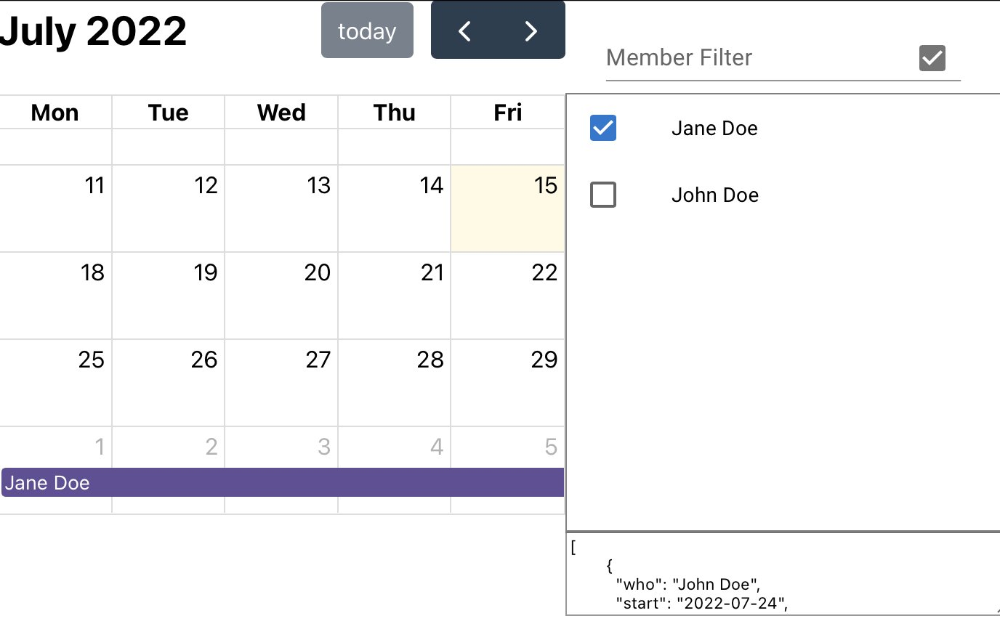

# 100 Days Of Code - Log

## Day 8: 2022-07-15

[Tweet](https://twitter.com/BudavariMatyas/status/1547993617137954822)

**Today's Progress**: Today I got an hour to polish my calendar viewer that I wrote about a few days ago. It still has a long way to go but now it's usable enough for my needs.
I've added a github action to deploy it, and fixed some onboarding issues.

**Thoughts**: I needed to revisit date handling, but now it has a proper onboarrding experrience for newcomers. Mobile view is still a mess.

**Link(s) to work**: [Calendar App](https://budavariam.github.io/absence-calendar/)

## Day 2: 2022-07-02

[Tweet](https://twitter.com/BudavariMatyas/status/1543252557954514944)

**Today's Progress**: I've made my header with #p5js 👀

**Thoughts**: 

**Link(s) to work**: [p5.js Web Editor](https://editor.p5js.org/budavariam/full/0k6O1bWdc)
