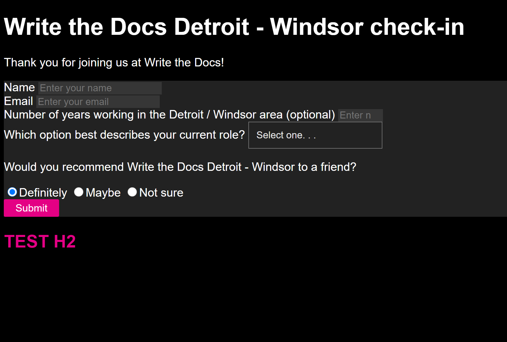
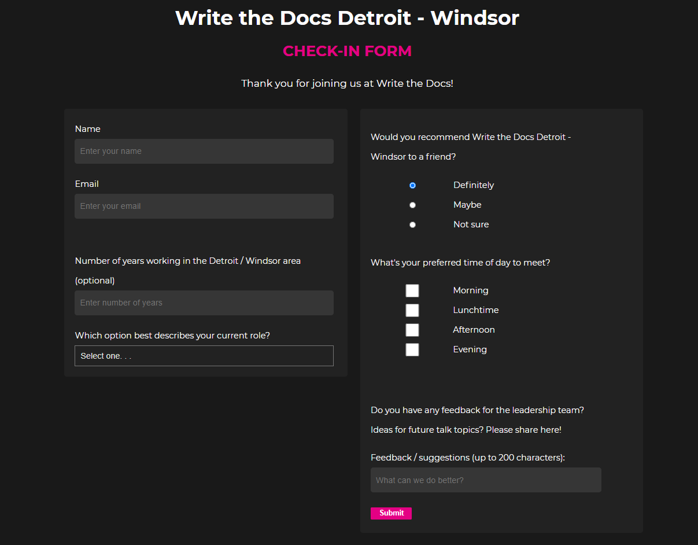
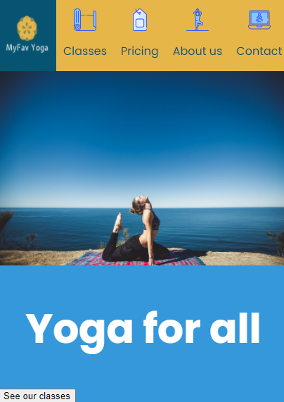
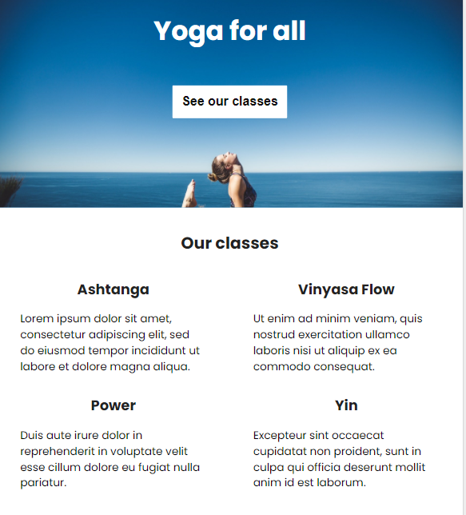
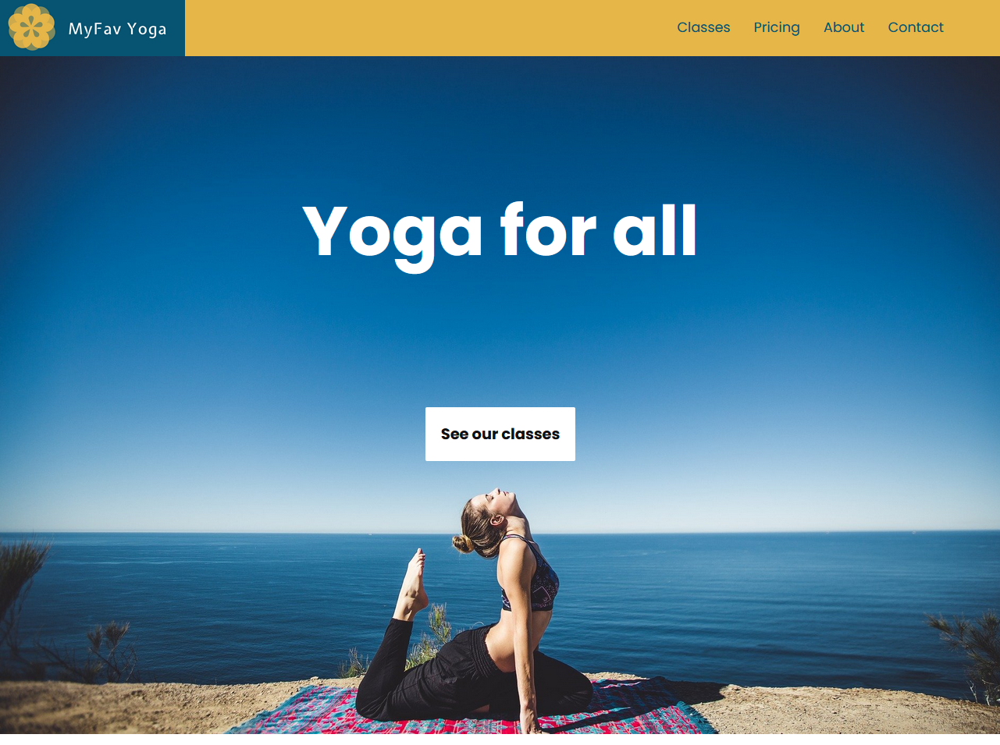
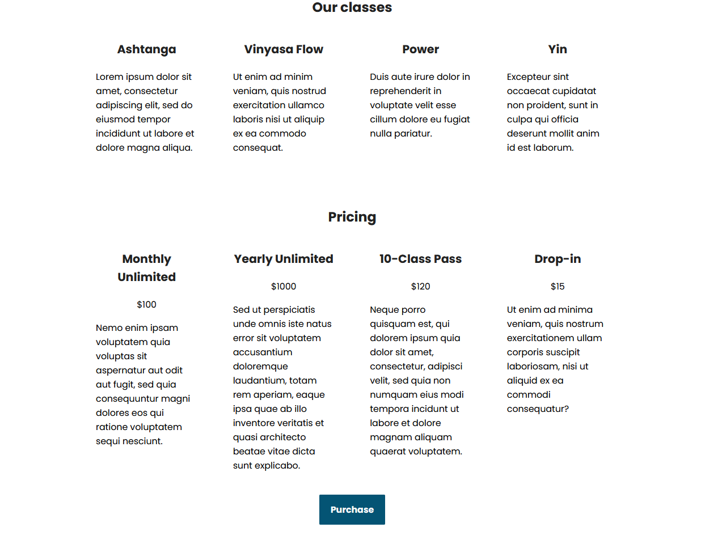

# 100 Days Of Code - Log

### Day 1: October 27, 2020
**Today's Progress**: Applied styles to Michelle Obama tribute page in FCC
responsive web design challenge.

**Thoughts:** This is fun! And it really is hard to stop once you get going.

**Link to work:**
[Today's PR](https://github.com/newwebash/fcc-tribute-page/pull/5)

### Day 2: October 28, 2020

**Today's Progress**: Applied more styles to Michelle Obama tribute page, also
fixed some typos. I copied the code into a Codepen and linked to it from my
repo's readme.

**Thoughts**: This is really fun! This first coding challenge is pretty simple
though. Actually, I considered adding more flourishes to the site but thought
it just didn't fit the challenge brief.

**Link(s) to work**:

1. [Updated readme](https://github.com/newwebash/fcc-tribute-page)
2. [PR 7](https://github.com/newwebash/fcc-tribute-page/pull/7) and [PR 5](https://github.com/newwebash/fcc-tribute-page/pull/5)
3. [Live site on Codepen](https://codepen.io/NewWebAsh/pen/MWerNqq)

### Day 3: October 29, 2020

**Today's Progress**: Started working on the Survey Form challenge.

**Thoughts**: It's been awhile since I last created an HTML form. It's like
riding a bike - I just have to glance at the documentation for a refresher on
things, but it's all coming back.

**Link(s) to work**
1. [Source code in new repo](https://github.com/newwebash/fcc-survey-form)

**Screenshot**

Here's where I left off today:

### Day 4: October 30, 2020

**Today's Progress**: Finished the user stories in FCC's
[Responsive Web Design Projects - Build a Survey Form](https://www.freecodecamp.org/learn/responsive-web-design/responsive-web-design-projects/build-a-survey-form)

**Thoughts** Today was slower than previous days. I got stuck on
trying to style the checkboxes in my form. I found some advice on the w3schools
site, as well as on Stack Overflow, but wasn't able to successfully style the
checkboxes as I had wanted to.

I also asked in FCC Discord and the person who
responded reaffirmed that these are notoriously difficult to manage with CSS.

So after awhile I moved on without applying the styles I had wanted.

**Link(s) to work**: https://github.com/newwebash/fcc-survey-form/pull/3

### Day 5: October 31, 2020

**Today's Progress**: Went through FreeCodeCamp lessons on CSS Flexbox and CSS
grid. I experimented with applying the material to my site but didn't merge
any code.

**Thoughts**: I've used this stuff before but it's been awhile, so it's good
to review. I think that layout is the toughest part about CSS, in my experience.

### Day 6: November 1, 2020

**Today's Progress**: Adjusted survey form layout using CSS grid but it looks
pretty buggy and needs more work.

**Thoughts**: On the one hand, I'm a little frustrated that CSS layouts are so
hard to get right, but glad that I'm focusing my attention here so I can level
up.

**Link(s) to work**: Today's [PR](https://github.com/newwebash/fcc-survey-form/pull/5)

### Day 7: November 2, 2020

**Today's Progress**: Made lots of progress on adjusting layout using a combo
of CSS grid and flexbox! I'm pretty much done with this challenge. I just need
to make some adjustments to my HTML markup before I can submit it.

**Thoughts**: This was fun! I'm glad I was able to overcome the layout challenges
I encountered after some more effort!

**Link(s) to work**:
1. [Source code in CodePen](https://codepen.io/NewWebAsh/pen/GRqdweX)

**Screenshot**

Here's the finished layout on a large screen:

### Day 8: November 3, 2020

**Today's Progress**: I made a few last changes to my survey form to be able
to pass the automated tests by FCC. The only noticeable user-facing change
is that the last input field is now a `<textarea>` instead of `<input>`.

I also started working on the next FCC Code challenge to create a [product
landing page](https://www.freecodecamp.org/learn/responsive-web-design/responsive-web-design-projects/build-a-product-landing-page).

**Thoughts**: Since this challenge includes using a few different images as
well as a video, there's some risk of getting sidetracked. For example, I
spent maybe 10 minutes creating a logo for a fictional business.

I'm also not feeling 100% today, so I feel a little slow getting things going.

**Link(s) to work**: First commit to new repo: https://github.com/newwebash/fcc-product-landing-page/commit/41df22410e9d22381b1ee710e3451653c28f7019

### Day 9: November 4, 2020

**Today's Progress**: Finished adding minimum required html elements to landing
page and also started adding CSS.

**Thoughts**: CSS can be so finicky and frustrating sometimes! I'm also trying
to think of ways I can work more quickly. However, I also see value in taking my
time with these basic front-end projects so I can use them as building blocks
for future projects.

**Link(s) to work**: Today's [latest PR](https://github.com/newwebash/fcc-product-landing-page/commit/7d40df14f5dffea1deaeb84b1847fc854dd906c8)

### Day 10: November 5, 2020

**Today's Progress**: Was able to fix some spacing issues in the site for
mobile, and made lots of progress on the nav bar for mobile.

**Thoughts**: Although I felt frustrated yesterday, I got a rush from making
so much progress today!

**Link(s) to work**: Today's [latest commit](https://github.com/newwebash/fcc-product-landing-page/commit/b3b6ad4e8ba03152d686fba2348bfdd5fc46775b)

### Day 11: November 6, 2020

**Today's Progress**: I more or less finalized the header nav on mobile, then
moved on to format the intro section and am starting to work on the "Our Classes"
section.

**Thoughts**: Same as in previous days, I fluctuate between being frustrated
with CSS layouts and then feeling very rewarded once I get it working the
way I want, and it looks great!

**Link(s) to work**: Today's [PR](https://github.com/newwebash/fcc-product-landing-page/pull/4)

### Day 12: November 7, 2020

**Today's Progress**: Finished the basic layout for small mobile screens. There's
a bit more styling to do to smooth out the rough edges, but it's pretty good
as of now!

**Thoughts**: It's so exciting to see things coming together!

**Link(s) to work**: Day's [PR](https://github.com/newwebash/fcc-product-landing-page/pull/6)

### Day 13: November 8, 2020

**Today's Progress**: Made a few minor adjustments to small mobile styles and
started working on layout for mid-size screens.

**Thoughts**: It felt like I spent lots of time working with CSS and getting
nowhere. The site was just super finicky and broken on a larger screen and
every adjustment I made had unintended effects. I decided after awhile to take
a break, clear my head, and hopefully see it with a fresh set of eyes tomorrow morning.

**Link(s) to work**: Today's [PR](https://github.com/newwebash/fcc-product-landing-page/pull/7)

### Day 14: November 9, 2020

**Today's Progress**: Made progress on adjusting layout for mid-size screen.
First I started working with CSS grid but scrapped that in favor of flexbox.

I'd like to keep working on this more but have to stop since I've got a busy
morning!

Screenshot of section that went well today:

**Thoughts**: Again, it feels like two steps forward and one step back. Still,
I'm happy with the net one step made forward!

**Link(s) to work**: Today's [PR](https://github.com/newwebash/fcc-product-landing-page/pull/7)

### Day 15: November 10, 2020

**Today's Progress**: Finished layout for pricing section on larger mobile screen.

**Thoughts**: I didn't have much time to work on this today due to other
priorities. I'm glad I was able to spend an hour working on this but I really
need more time to focus in order to make progress.

**Link(s) to work**: Today's [PR](https://github.com/newwebash/fcc-product-landing-page/pull/8)

### Day 16: November 11, 2020

**Today's Progress**: Finished layout for contact form and footer. Also adjusted
global styles for contact form fields.

**Thoughts**: At this point it feels like I'm losing time just making minor
tweaks trying to get the layout right. Are there any tips out there for how
to work more efficiently? I think if I could do it over again, I'd create one
empty starter section with just numbered boxes with different background colors,
adjust and harden the layout for different screen sizes, then go back and
duplicate that initial pattern for each new section of the landing page, then
go back and fill in the different sections as needed. I had tried to build in
certain structure patterns in the different sections as I initially started
building out this landing page, but it seems to have backfired. The CSS file
is now so long and the intermingling of different classes, etc. . .is complex
and unwieldy, it seems like I fix one thing and another thing breaks.

Anyway, at least I'm learning from this and can experiment with my idea next
time I build a site.

**Link(s) to work**: Today's [PR](https://github.com/newwebash/fcc-product-landing-page/pull/9)

### Day 17: November 12, 2020

**Today's Progress**: Tested and debugged CSS for small and mid-size screens.
The results aren't perfect, but they're good enough for now. Some more polish
will be needed after I do the layout for larger screens, anyway.

**Thoughts**: Same as other days: CSS can be both fun and frustrating.

**Link(s) to work**: Today's [PR](https://github.com/newwebash/fcc-product-landing-page/pull/10)

### Day 18: November 13, 2020

**Today's Progress**: Started formatting for larger screens / desktop.

**Thoughts**: I'm getting anxious to finish this project so I can move on to
try my hand at some new skills. But on the other hand I want to make sure this
one's high-quality, so I'll take the time that I need.

**Link(s) and screenshots**:

1. Screenshot above the fold:

   

2. Screenshot below the fold:

   

3. Today's [PR](https://github.com/newwebash/fcc-product-landing-page/pull/12)

### Day 19: November 14, 2020

**Today's Progress**: I  believe I'm done with all significant layout styles!!!
Tomorrow I want to go through and make sure all of the project user stories are
complete, and do some (hopefully) final testing before I can submit this project
and move on to the next one!

**Thoughts**: I'm so glad I switched to Firefox dev tools - no offense but the
dev console in FF was way more helpful than the one in Chrome, at least for
CSS Flexbox.

**Link(s) to work**: Today's [PR](https://github.com/newwebash/fcc-product-landing-page/pull/13)

### Day 20: November 15, 2020

**Today's Progress**: I made a few changes to my html markup to improve
accessibility. I also imported my source code into Codepen and ran the tests
provided by FreeCodeCamp. I failed most of the tests but this seems to be
related to other html markup requirements. I don't think it should be too
big of a lift to make the fixes to pass those tests.

**Thoughts**: Happy to be close to finishing this project!

**Link(s) to work**: My project in [Codepen](https://codepen.io/NewWebAsh/full/GRqeRbb)

### Day 21: November 16, 2020

**Today's Progress**: Modified HTML markup to pass automated tests, also
modified css based on feedback from CSS Linter.

**Thoughts**: It's a great day!

**Link(s) to work**: My updated project [readme](https://github.com/newwebash/fcc-product-landing-page#fcc-product-landing-page)

### Day 22: November 17, 2020

**Today's Progress**: Started refactoring CSS based on DRY principle and to avoid
linking styles to IDs.

**Thoughts**: About a week ago I expressed the need to find ways to work more
efficiently. I had an aha! moment yesterday when I linted my CSS. Now I have
better ideas about how to code my CSS more efficiently, but before I move onto
the next project, I've decided to refactor the CSS in this landing page site.

It's a bit disappointing that I can't move on to the next challenge yet, but
I want my portfolio samples to be ironclad, so it's worth taking a bit more time
to make sure this one's correct.

**Link(s) to work**: Today's [PR](https://github.com/newwebash/fcc-product-landing-page/pull/17)

### Day X:

**Today's Progress**:

**Thoughts**:

**Link(s) to work**:
