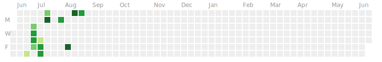
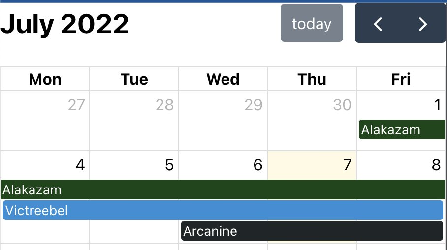
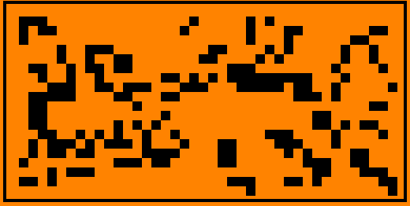

# 100 Days Of Code - Log



## Day 1: 2022-07-02

[Tweet](https://twitter.com/BudavariMatyas/status/1543250339385823232)

**Today's Progress**: I'll try to move my english hardcore softwaredev tweets and retweets to my alt account
`@BudavariMatyas`, let's see how it goes 🤞

**Thoughts**: I can consider this as the beginning, since this is the marker when I started to split my dev and personal accounts on twitter, even though I did not mark it explicitly.

## Day 2: 2022-07-02

[Tweet](https://twitter.com/BudavariMatyas/status/1543252557954514944)

**Today's Progress**: I've made my header with `#p5js` 👀

**Thoughts**: What I like the most in this is that it supports dark mode and stops the animation for those who prefer reduced motion.

**Link(s) to work**: [p5.js Web Editor](https://editor.p5js.org/budavariam/full/0k6O1bWdc)

## Day 3: 2022-07-05

[Tweet](https://twitter.com/BudavariMatyas/status/1544366260342890497)

**Today's Progress**: I missed the last battle, but it's still nice to practice CSS with `@css_battle`

**Thoughts**: I love to think about css alignment, css battles are coming.

**Link(s) to work**: [Curtain - Mátyás Budavári](https://budavariam.github.io/css-battle-showcase/battles/19-spacing/109-curtain)

## Day 4: 2022-07-06

[Tweet](https://twitter.com/BudavariMatyas/status/1544758709561303041)

**Today's Progress**: At last got enough points to get into the global leaderboard!

`#smallSteps` 8925th / 209746

`#cssbattle` `#100DaysOfCode`

**Thoughts**: I thought 3D would ake it easy for me, I spent too long that I'd feel safe to admit to align it perfecctly. The diff helps a LOT.

**Link(s) to work**: [Black Light - Mátyás Budavári](https://budavariam.github.io/css-battle-showcase/battles/19-spacing/113-black-light)

## Day 5: 2022-07-07

[Tweet](https://twitter.com/BudavariMatyas/status/1545117522613207043)

**Today's Progress**: `#100daysOfCode` day 5:

I wanted to visualise custom multi-day events in a calendar for a while, let's see how it goes.

is pretty easy to use, it can be embedded in a few lines of code.
I'll have many ideas how to fine tune it...

**Thoughts**: It was just a proof of concept, but I have high hopes in this one.

**Link(s) to work**: [FullCalendar - JavaScript Event Calendar](https://fullcalendar.io/)



## Day 6: 2022-07-08

[Tweet](https://twitter.com/BudavariMatyas/status/1545446006136897536)

**Today's Progress**: `#100DaysOfCode` Day 6

I made a script to get size of folders per date from an s3 bucket using `#s3curl` and visualized it with `#plotlyJS`

I had around 1 hour time limit for learning and coding. Besides a nasty typo in "marker" based pagination, everything worked on the first try 🎉

**Thoughts**: It was an amazing exercise, if I'll need to use it again I pimp it up to a shareable form.

## Day 7: 2022-07-14

[Tweet](https://twitter.com/BudavariMatyas/status/1547713647815733250)

**Today's Progress**: `#100DaysOfCode` Day 7:

Practice CSS rotation and its quirks at `#cssbattle`

**Thoughts**: Some browsers handle the border with rotation pretty badly even if I tell that I'll transform it. At least the css battle server accepted it.

**Link(s) to work**: [Tesseract - Mátyás Budavári](https://budavariam.github.io/css-battle-showcase/battles/1-pilot/9-tesseract)

## Day 8: 2022-07-15

[Tweet](https://twitter.com/BudavariMatyas/status/1547993617137954822)

**Today's Progress**: `#100DaysOfCode` Day 8

Today I got an hour to polish my calendar viewer that I wrote about a few days ago. It still has a long way to go but now it's usable enough for my needs.
I've added a github action to deploy it, and fixed some onboarding issues.

**Thoughts**: I needed to revisit date handling, but now it has a proper onboarrding experrience for newcomers. Mobile view is still a mess.

**Link(s) to work**: [Absence Calendar](https://budavariam.github.io/absence-calendar/)


## Day 9: 2022-07-16

[Tweet](https://twitter.com/BudavariMatyas/status/1548334043460018178)

**Today's Progress**: `#100DaysOfCode` Day 9

Today I've started to log my progress properly on github as well.
In order to avoid having to manually duplicate the text I write here, I've created a small python script to get these entries via TwitterAPI

`#100Devs`

**Thoughts**: It was a fun experience, I have some ideas where to go next with this. It took more than I expected, I'm glad I switched to python early on.

**Link(s) to work**: [100-days-of-code/main.py at master · budavariam/100-days-of-code](https://github.com/budavariam/100-days-of-code/blob/master/utils/twitter/main.py)

## Day 10: 2022-07-17

[Tweet](https://twitter.com/BudavariMatyas/status/1548722515379458050)

**Today's Progress**: `#100DaysOfCode` Day 10

I've started to log my journey on learning `#spanish` in `#hungarian` using `#11ty`

My usual steps of writing about a new topic:
- Get a static site generator
- Browse themes
- Choose a different SSG
- Switch theme
- Rewrite the theme

**Thoughts**: I struggled between learning a new flavour of static site generators or use one that I already know. So I chose one that I've used a bit. I decided to spend this day organizing my spanish learning material, now I'll have a place to put them moving forward.

**Link(s) to work**: [Learning Spanish](https://budavariam.github.io/learning-spanish/)

## Day 11: 2022-07-18

[Tweet](https://twitter.com/BudavariMatyas/status/1549151425418219525)

**Today's Progress**: Day 11 of `#100DaysOfCode`

Today I took it easy and got the basis for further development. I've added csv-processor for a new word list table in my spanish learning page.

**Thoughts**: It took me a while to figure out how to load csv data, but luckily with eleventy I can define custom data inputs.

**Link(s) to work**: [Szavak](https://budavariam.github.io/learning-spanish/szavak/)

## Day 12: 2022-08-01

[Tweet](https://twitter.com/BudavariMatyas/status/1554210080802967558)

**Today's Progress**: `#100DaysOfCode` Day 12

I mixed `#appleScript` and `#python` to extract events from the Calendar app and add filtered events back into another calendar for the next few weeks.

The most tricky part was handling the recurrent rule format to regenerate the events, and ofc `#timezones`

**Thoughts**: The sad part with the events handled in Calendar app is that AFAIK I can not query for a specific time interval in the future. Rather I have to get ALL events, parse their recurrence rules (shoutout to [dateutil.rrule](https://dateutil.readthedocs.io/en/stable/rrule.html)) and generate when they occur and filter to the given date.
There might be a simpler method, I hadn't not yet found any. Other than this I needed to chase down a nasty case.

```log
INFO:generate_event_dates "2022/03/11 17:15:00", "FREQ=WEEKLY;UNTIL=20220915T132959Z"
...
ValueError: RRULE UNTIL values must be specified in UTC when DTSTART is timezone-aware
```

## Day 13: 2022-08-12

[Tweet](https://twitter.com/BudavariMatyas/status/1558191455402921985)

**Today's Progress**: `#100DaysOfCode` Day 13

I've started dusting off my ancient C knowledge and getting my hands dirty with custom `#flipperzero` plugin development.
Today I successfully built a custom firmware with a basic hello word app.

**Thoughts**: I need to revisit many things from the university C classes. I was surprised how easy it was to build my app as needed. I'd bee happy to have some kind of emulator or debugger. We'll see.

## Day 14: 2022-08-14

[Tweet](https://twitter.com/BudavariMatyas/status/1558762543904169985)

**Today's Progress**: `#100DaysOfCode` Day 14

I've created a `#flipperZero` plugin in C that plays Conway's Game of Life.

**Thoughts**:

**Link(s) to work**: [[Plugin] Conway's Game of Life by budavariam · Pull Request #1 · budavariam/flipperzero-firmware](https://github.com/budavariam/flipperzero-firmware/pull/1)



## Day 15: 2022-08-21

[Tweet](https://twitter.com/BudavariMatyas/status/1561328865305321473)

**Today's Progress**: `#100DaysOfCode` Day 15

I've added a simple `#darkMode` switch to my `#11ty` site. That'll make it easier for me to find the best color scheme later on.
A media query was already there for dark mode in the 11ty/eleventy-base-blog theme. Now my DevEx is better.

**Thoughts**:

**Link(s) to work**: [Add basic dark mode by budavariam · Pull Request #1 · budavariam/learning-spanish](https://github.com/budavariam/learning-spanish/pull/1/files)
