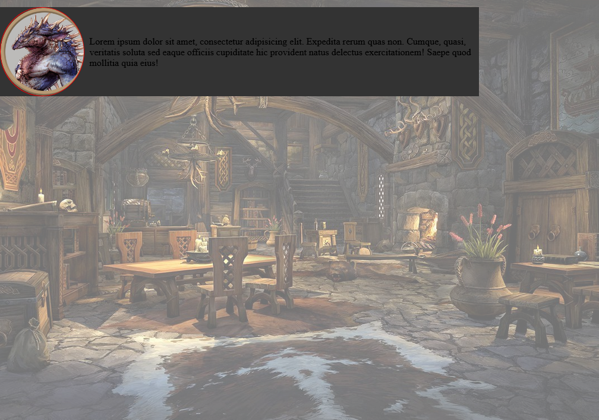
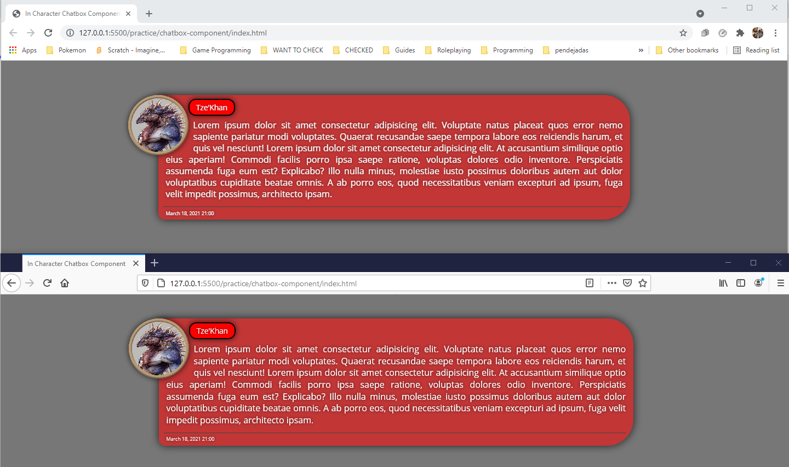

## [Log Entries](#log-entries)

- [Entries for 2021](#2021)
  - [Day 94 - Latest entry](#day-94)
  - [Day 93](#day-93)
  - [Day 92](#day-92)
  - [Day 91](#day-91)
  - [Day 90](#day-90)
  - [Day 89](#day-89)
  - [Day 88](#day-88)
  - [Day 87](#day-87)
  - [Day 86](#day-86)
  - [Day 85](#day-85)
  - [Day 84](#day-84)
  - [Day 83](#day-83)
  - [Day 82](#day-82)
  - [Day 81](#day-81)
  - [Day 80](#day-80)
  - [Day 79](#day-79)
  - [Day 78](#day-78)
  - [Day 77](#day-77)
  - [Day 76](#day-76)
  - [Day 75](#day-75)
  - [Day 74](#day-74)
  - [Day 73](#day-73)
  - [Day 72](#day-72)
  - [Day 71](#day-71)
  - [Day 70](#day-70)
  - [Day 69](#day-69)
  - [Day 68](#day-68)
  - [Day 67](#day-67)
  - [Day 66](#day-66)
  - [Day 65](#day-65)
  - [Day 64](#day-64)
  - [Day 63](#day-63)
  - [Day 62](#day-62)
  - [Day 61](#day-61)
  - [Day 60](#day-60)
  - [Day 59](#day-59)
  - [Day 58](#day-58)
  - [Day 57](#day-57)
  - [Day 56](#day-56)
  - [Day 55](#day-55)
  - [Day 54](#day-54)
  - [Day 53](#day-53)
  - [Day 52](#day-52)
  - [Day 51](#day-51)
  - [Day 50](#day-50)
  - [Day 49](#day-49)
  - [Day 48](#day-48)
  - [Day 47](#day-47)
  - [Day 46](#day-46)
  - [Day 45](#day-45)
  - [Day 44](#day-44)
  - [Day 43](#day-43)
  - [Day 42](#day-42)
  - [Day 41](#day-41)
  - [Day 40](#day-40)
  - [Day 39](#day-39)
  - [Day 38](#day-38)
  - [Day 37](#day-37)
  - [Day 36](#day-36)
  - [Day 35](#day-35)
  - [Day 1](#day-1)

- [About me](#about-me)

**#100DaysOfCode Log - Round 2 - Anubis Lockward**
**The log of my #100DaysOfCode challenge. Started on [April 19th, Friday, 2019].**

**Log**

**R2D1 - April 19th, 2019**
For these past few days have been learning some stuff about HTML and CSS without using libraries. Today I decided to keep on advancing the Free Code Camp curriculum and created the Technical Documentation Page, may style it a bit more in the future, maybe not. Check it out here: https://mr2much.github.io/webdev/techdoc/index

**R2D2 - April 20th, 2019**
I have been waiting for this day since I started. The R2D2 day, it's finally here. Continued improving my Front End skills with CSS and today I made my first contribution to an opensource project. Hope the guys at w3develops like what I did and merge my changes. Fingers crossed.

**R2D3 - April 21st, 2019**
Noticed that there was something I left out on the pull request I pushed to the guys at w3develops, today I corrected it and pushed it again. Then kept advancing on the HTML/CSS/Sass course I'm taking at Udemy. Worked a little on the first project of the site.

**R2D4 - April 22nd, 2019**
Ok, I've decided that for this round, I'll focus entirely on finishing the Modern HTML & CSS From The Beginning (Including Sass) course on Udemy. Today I worked a bit more on the first project of that course. I certainly enjoy working on UI/UX

**R2D5 - April 23rd, 2019**
Finished the first project of the Modern HTML & CSS From The Beginning (Including Sass) course, I have not made it responsive yet, but that's what the next part of the course will cover. Hmmm, maybe I'll go ahead and do that myself first, before watching the rest of the chapter.

**R2D6, R2D7, April 27th, 2019**
Have learned a few things about CSS that I hadn't seen covered anywhere else. And got a better understanding of how em and rem units work.

**R2D8, April 28th, 2019**
Finished with the chapter about making things Responsive using CSS on the Model HTML & CSS From The Beginning (Including Sass) Udemy course, and just started a chapter about Flexbox. So many ideas pouring into my head right now, don't even know where to start. Gotta stay focused.

**R2D9, R2D10, April 29th, May 1st, 2019**
I have been working on a Technical Documentation site that's going to be used in my department to train the new recruits for these past few days, and today I watched two videos of the HTML & CSS course.

**R2D11, R2D12, May 2nd, May 4th, 2019**
Not much going on, just practicing my HTML and CSS, got into an issue that I couldn't solve with a fixed top navbar, a body with a padding, and the navigation sidebar with hashed links, that kept wrecking my layout, couldn't solve it, working on it.

**R2D13, May 5th, 2019**
More HTML and CSS practice.

**R2D14, May 5th, 2019**
Still working on the HTML & CSS project of the Udemy course I'm currently taking. This is how the page looks right now: https://mr2much.github.io/webdev/edgeledger/ Learned how to add a map using Google's API

**R2D15, May 9th, 2019**
* Added smooth scrolling
* Made site responsive
* Fixed some issues with showcase

**R2D16, May 10th, 2019**
I fixed the issue with the documentation site at work, the problem was caused because the margin I added to the top to clear the navbar, was pushing the content down, so I had to add some padding at the bottom of the content of the same amount as the margin, and that pushed it back up. Also fixed an issue with the Google Map not displaying on mobile screens on the EdgeLedger site

**R2D17, May 23rd, 2019**
It's been almost two weeks since the last time I updated this, I have not stopped tinkering around with HTML and CSS but have done nothing major worth updating here anyways. Truth is that I have been kind of down, but even if I don't post I won't stop making progress.

**R2D1 and R2D2, October 3rd-4th, 2019**
Restarted the Second Round of the 100 Days of Code Challenge since I had stopped at May 23rd of this year and haven't posted since then. Last time I managed to go 17 days into the second round, now I gotta finish it this time. I'll also try to keep advancing my Game Development course since creating games was what got me started into programming in the first place and it's always been a dream of mine. Meanwhile, I'll keep posting the updates to my WebDev Bootcamp on this file. I'm feeling really excited right now about getting back on track. Now I'm learning about basic JavaScript concepts. I had stopped the course but now I'm at unit 9.

**R2D3, October 5th, 2019**
Had some fun with boolean operators in JavaScript and a fun little HTML page to display the results. Got totally sidetracked from today's lesson but I just wanted to see if I was able to do it.

**R2D4, October 6th, 2019**
Fooled around a bit more with JavaScript's boolean operators. Really getting hooked on practicing once again. I'm really enjoying this.

**R2D5-6, October 7th-8th, 2019**
Finished Section 9 of the WebDev Bootcamp and got through most of Section 10. Wasting time is becoming harder, even though staying focused is even harder. At least I stop myself from procrastinating too much and am able to stay on track for longer periods of time.

**R2D7, October 9th, 2019**
Well, actually realized I was not in Unit 9 of the course but Unit 12, and I already finished it and started Unit 13. Can't wait to get to the good stuff since right now we're just touching basic concepts. But I know I have to be patient.

**R2D8-9, October 10th-11th, 2019**
Advancing through Unit 13 of the Web Dev Bootcamp, learning about handling Arrays in JavaScript, made a simple TODO list. Almost halfway through until I get to OOP in JS

**R2D10, October 14th, 2019**
Kept learning about handling arrays in JavaScript. Practiced today how to use Array.forEach() and learned about using Array.splice() to remove elements from the array using an index, which I didn't know about. Thinking about improving my TODO page that's on my portfolio.

**R2D11, October 16th, 2019**
Done with Unit 13 and now started Unit 14, an introduction to Object in JavaScript, really excited by this and then it's on to DOM manipulation.

**R2D12, October 22nd, 2019**
Got through Unit 14 of the Web Developer Bootcamp on Udemy. Object manipulation in JavaScript is a little bit different than what I'm familiar with. Now on to Unit 15 where I'll learn about DOM manipulation. And also started working on a project that I've always wanted to make.

**R2D13, R2D14, R2D15, October 28th, 2019**
Not completely sure if it's been three or four days, but I'm gonna assume it's been only three. I finished Section 15 of the Web Dev course and finished with the basics of DOM manipulation. Now it's on to Section 16 to learn about advanced DOM manipulation, which is where I stopped the course last time on 2018

**R2D16, R2D17, October 29th and October 30th, 2019**
Finished with Section 16 of the Web Development Bootcamp on Udemy about advanced DOM manipulation. Did some fun projects and learned about separation of concerns between the styles, the structure and the programming logic behind it all. I'm pretty excited to be starting Section 17. In the mean time, I used what I learned from these lessons and updated my TODO List, now you can Add a new entry to the TODO list, and it is added with a cool little animation, but you can also remove the entries by right clicking on them, they fade away graciously with another neat little animation. Check it out: https://mr2much.github.io/webdev/todolist/html/index

**R2D18, R2D19, R2D20, October 31st, November 1st, November 2nd, 2019**
I have been learning about class creation in JavaScript, it's kind of confusing since I'm used to how it is done in C++, Java and C#, but JavaScript is a Prototypal language so there's no such thing as "Classes" in the classical sense. Also I'm almost finished with unit 17 of the course, gonna finish it tomorrow since I'm tired for today

**R2D21, November 5, 2019**
Finished the color guessing game project. I'm feeling really excited about the course and I'm really looking forward to keep digging into how JavaScript handles OOP. Now I'm starting unit 18, which is an intro to jQuery. Here's the link to the game: https://mr2much.github.io/webdev/colorgame/

**R2D1, July 4, 2020**
Restarting 100 days of code challenge for the second round. I decided that I'm going to dedicate two hours each day to this challenge to advance my Modern HTML & CSS From the Beginning course on Udemy. If I keep my pace right, I will be able to finish it in 10 days. I also decided to restart the course from scratch, since it's been so long since I last coded something that I've forgotten most of it. Lately I've been assessing what motivates me and keeps me going with this stuff and I have come to realize that getting myself organized with a set schedule to do things helps me in seeing how far I have advanced, and pushes me to keep going. I have come to understand that I won't do stuff just because I have to do it, nor without following a set constraint for myself, be it with my Gym routine, or even for learning to coding. I will try to also learn JavaScript along with the material of this course and then I will see from there. Today I managed to do only three Pomodoros instead of the four I proposed myself on achieving each day. But I don't really mind. I am going to take advantage of the time I have available. Lately I have not been doing much because I have felt down for some reason and unmotivated, but I hope that by sticking to my set routine I will be able to do the things I want to do.

**R2D2, July 7, 2020**
Worked a bit on my personal project for the D&D Spell visualizer, and advanced a bit on the Modern HTML course. Doing stuff with List, Tables and Forms. I have to learn how properly create the tables for a Database for the spells to be able to ask the appropriate question to the database and show them on the page. I'm almost finished with the basic introductory parts of HTML, and got a refresher on Block and Inline elements, as well as Divs, Spans, Classes and IDs. Looked at HTML entities and got a bit of an idea for an old project that I worked with a long time ago for a game. Maybe I'll try it out with that too, it uses the symbols for card sets. I arrived at the part for Semantic Tags and it seems that there's going to be some sort of challenge for that part. I'll work on it tomorrow.

**R2D3, August 1st, 2020**
I have been learning a bit of JavaScript and did a basic introduction on NodeJS. And finished the Section 2 on HTML Basics on the Modern HTML & CSS From the Beginning course on Udemy. I have been struggling with sticking to doing this frequently since I have not been doing the Pomodoros like I should. Have been beating myself over it quite a lot too, and each time I think that I'm failing that's how I really feel instead of feeling like I'm advancing. So I should also focus on avoiding that. I also managed to create a simple website in HTML that allows me to register phone numbers by using a couple inputs and a table, and I managed to get it to work with plain JavaScript, the code ended up being a completely awful mess but I managed to do the majority of it without having to do much googling around. The site doesn't have any CSS right now and the data doesn't persist. So I'll get to work in that as I keep pushing myself to finish the HTML course.

**R2D4, August 2nd, 2020**
I have been learning about how JavaScript handles primitives and Objects, and what their difference are. Learning the difference of using var, let and const, IIFEs, block scope, global and local variables. And Number methods, specifically, parseInt and parseFloat.

**R2D5, August 13th, 2020**
Today, progress was slow, if I can call it progress at all. Had a conversation with my wife telling her about all the things I want to accomplish, and how I am doing nothing at all to do so. I still struggle with how to come up with inspiration for what to do. I talked to her how I feel that I have been acquiring knowledge without any clear goal in mind. My mind is completely blocked, I can't seem to think of any ideas and when I try to do it, nothing comes to mind. Pushing myself beyond this point is one of the hardest things I've done in my life, and yet, every time I manage to break past this point, I bounce back and fall even harder the higher I raise. I know I should stop beating myself over it and stop comparing myself with others, and I even know that most people don't achieve true knowledge, yet I am still certain that I have not accomplished what goals I want to reach. I have many things to keep writing, and even feel like doing so, but at the same time, I see no point in doing it, and I don't want to either.

**R2D6, August 19th, 2020**
Worked a bit on my Phone Book web project today, trying to fix the table's styling and fixing a bug that was caused when I introduced values that were too long and messed up the column's width. Tweaked it a bit using table-layout:fixed in CSS and started working on a way to delete an entry from the list. I also worked on that yesterday but didn't do much. I have to add a way to edit the values on the table too, and then some way to store them, at least temporarily in an array until I get to learn how to store them in a database. I finally got my dual monitor setup working so I think that I'll be working on a more regular basis on getting into the coding habit.

I know I am skipping some posts since the last time I updated my entries for the challenge, and I don't remember exactly when was the last time I posted, but I have kept my log updated locally on my PC, and I'm currently on day 6. 

Motivation has been low these days, lost something along the way and I can't exactly tell what. But I rather keep advancing than standing still on the same place.

I got a dual monitor setup, which kind of inspires me to jump back into coding again, so I'm gonna use that as a crotch for the time being. I worked a bit on a simple project I came up with, trying to make it without googling around too much, and I realized that comparing what I have done with what others seem to be able to do will not get me anywhere, so I'm trying to not actually do that and realize that I don't really know the story behind how they got to where they are, or how they did certain things.

Another thing that demotivates me is that I seem to be only accumulating knowledge without doing anything useful with it, nor exactly knowing what to do with it. How do you even get past that? I feel like I did more when I knew less, but that might be something coming out from pure perception rather than actual reality, since, you know, you have the greatest potential of learning something when you know nothing about it in the first place, but after a certain point, everything you learn seems to mean so little in the grand scheme of things. Or you keep learning new stuff only to realize that there is still so much left to learn. Going back to the basic projects I used to do back when I was starting to learn how to code seems so pointless now, yet, that's what I think I need to do right now to improve at a slow steady pace. It's easier for me to do that in the gym than it is for computer programming, I have become so impatient, and I don't know why. Any advice?

**R2D7, August 20th, 2020**
Asked around on the Discord group for the challenge and someone pointed me to two helpful resources for ideas on projects I should be making. Today I started working on the logic and JavaScript code for a simple Binary to Decimal converter, and I managed to make it work without googling around. Just had to freshen up the logic by watching a Math course on Khan Academy. Noted a few things that I have yet to implement to make the project better and what's this? two post made in two consecutive days?

I know it doesn't seem like much, and that I should be able to do those things already, but my goal here is to get back into the habit of coding, and I am learning JavaScript. So, I am going to take this as I do going back to the gym after a long hiatus, I am going to start back at a newbie level, even when I know that that might be detrimental to my success. Yet I am still taking a leapt of faith and getting back to the beginnings, so that I can make it to the end.

**R2D8, August 22nd, 2020**
I finished the JavaScript project for converting binary numbers to decimals, filling up all the requirements from the project. Now I have to work into making it look nicer since everything is just HTML with barely any CSS in it and have to polish the code up a bit.

**R2D9, August 24th, 2020**
I did a dopamine detox yesterday on August 23rd of 2020 trying to become more productive. I won't say much changed but at least I learned how to motivate myself, why some things don't motivate me, or why some motivate me more than others. I managed to read 100 pages of a book that I had put off for almost two years.
I also did a lot of practice learning about HTML tables and how to style them which is something I also wanted to do for a personal project. But I have yet to finish styling the Binary to Decimal converter though.

I will try to do the dopamine detox at least once a week since when you are a parent with two kids, it's almost impossible to completely avoid some stimuli from reaching you -like when they start singing or listening to music, for example-, all in all, I think it wasn't as bad as I expected it to be, and at least I managed to code for several hours today.

**R2D10, August 31st, 2020**
This week's advancement has been slower than I had desired, but still not fully stopped. I managed to configure WakaTime on VS Code to track how much time I spent on conding. Althought I cannot track in there how much time I spend reading or investigating about how something works, like I have been doing with table elements in HTML for my simple personal project, I spent more than two hours just on that alone today. I have to also finish working on the Binary to Decimal Converter's styling and some other details, but that's on my list of TO-DOs before I set out to work on a third project. I have read about three chapters of the book that I was reading, and did some exercise too.

**R2D11, September 7th, 2020**
Today was one of the most productives days I've had so far. I managed to wake up early, read a few pages of a book, and managed to invest time learning about HTML, styling them and even threw in some JavaScript in there. All in all I spent 2 and a half hours coding, and almost four hours in total doing just that. It's only 10:00 AM and I can even spend the rest of the day leisurely without feeling any regrets. The only thing I'm missing is doing some exercise, let's see if I'm in the mood for that later in the day. I'm loving this day.

**R2D12, September 8th, 2020**
Today I kept learning about some tips and tricks to style HTML Tables, and make some cool effects using JavaScript and CSS. I also managed to code for another 2 and a half hours today.

**R2D13, September 11th, 2020**
Today was a fun day. Instead of trying to keep advancing on the tips and tricks from the Complete Guide to the Table Element, I focused on practicing what I have learned so far. I started tweaking around trying to create a table with editable cells. Ran into some issues with some incorrect padding that was being added between the cell and the input field but I managed to fix it, thought I confess I had to do some googling around the final solution I found it on my own, since none of the results I found solved it. Then practiced styling the table without checking on my previous lessons and with minimal google-fu except for looking at syntax at MDN, and I am very happy with the end result. I practiced for about 2 hours and 50 minutes today.

**R2D14, September 12th, 2020**
Started doing some experiments with styling my simple project using what I have learned so far about HTML tables. Managed to create an element from scratch in JavaScript and improved the styling of the table I was using to show the data. Tested that the new elements being added were appearing with the correct stylings and now I only have to make all new entries editable and implement the functionality for deleting entries.

**R2D15, September 13th, 2020**
Improved the styling of my project a bit more and managed to make all the new entries added to the table editable. Now I only have to implement the delete functionality and a way to store the entries.

**R2D16, September 23rd, 2020**
Kept tweaking a bit more with stylings and managed to implement the JavaScript code for deleting entries from the table, implemented it on a weird fugly way at first, and then a friend told me of a simpler way with Element.closest(). I have finally finished a basic CRUD in a web project which is a first for me. Now I only have to make the data persist in some way, so it might be a good time to start learning how to do it on Node. Althought I want to keep learning JavaScript since my current understanding of it is kind of bogus. Also learned a bit about Math, Number and String in JavaScript, as well as how includes(), trim(), split(), toUpperCase() toLowerCase() and a bunch of other methods work in JavaScript and comparing the similarities it has with Java which is the language I am most familiar with.

**R2D17, September 24th, 2020**
Keep going through the basics of JavaScript, today was templatized strings, and how to create Objects and assign them properties and methods.

**R2D18, September 25th, 2020**
Got an intro into Function Context in JavaScript, how to add properties and methods to objects, and nested objects. And also learned that JSON meant 'Java Script Object Notation'. I have used JSON files before in Java, but never bothered to learn where the format came from. Watched a couple of videos on how JavaScript handles Control Flow statements, and the different logical comparators it uses. Pretty basic stuff, but I'm trying to advance this with baby steps even thought I know how most of these stuff are handled already.

## 2021

I decided to restart the challenge since I forgot most of what I learned due to lack of practice, well, basically the same reason of why I restarted it the first time in the first place.

### Day 1
**R2D1, January 5th, 2021**
Finished section 5 of the Web Developer Bootcamp for HTML Forms & Tables. Also practiced replicating some tables found on Wikipedia articles.

### Day 2
**R2D2, January 7th, 2021**
Completed section 6 of the Web Developer Bootcamp 2021, covering the very basics of CSS. Did a couple exercises and practiced a little bit with styling a simple page.

### Day 3
**R2D3, January 10th, 2021**
Went through the Section 7 of the course, refreshing my knowledge about CSS Selectors and practicing a bit with a fun little site. Went through half the lesson.

### Day 4
**R2D4, January 12th, 2021**
Finished Section 7. I Learned a few things about CSS selectors, the difference between Pseudo classes and pseudo elements, and a few things about Specificity. I also saw a few options of the Dev Tools on Google Chrome that I didn't know about. Also I learned that there are certain properties on the elements that are not inherited by default which can be changed by setting that property to 'inherit'

### Day 5
**R2D5, January 16th, 2021**
Started Section 8, which covers the CSS Box Model. Watched a couple of videos explaining some of the properties of the Box Model, like with, height and Border.

### Day 6
**R2D6, January 17th, 2021**
Learned a few things about Borders and box-sizing, made a little practice and then learned about padding.

### Day 7
**R2D7, January 18th, 2021**
Today's videos covered: Margin, Display, the difference between Inline, Block, and Inline-Block elements and how Width, Height, Margin and Padding behave for each of these display properties. Also talked about relative units, like percentages, EMs and REMs. I also learned that line-height is related to the font-size of the element. Now going to start Section 9 and see some useful CSS properties. Also started working on creating a clone for an entry on Wikipedia about Dane axes.

### Day 8
**R2D8, January 19th-20th, 2021**
Started a practice project to create a Wikipedia clone for a particular entry. Added the content and made the summary part of the page look somewhat similar to the one I chose which is about Dane Axese.

### Day 9
**R2D9, January 21st, 2021**
Fixed the thumbnails for the images that appear on the Wikpedia page for Dane axes.

### Day 10
**R2D10, January 22nd, 2021**
Experimented about with the positioning of elements. Didn't work on my Wikipedia clone but worked on creating a test page where I could experiment and see how the different values for the Position property affected its elements and their containers. Also learn that the Sticky property doesn't work unless the element's Display property is set to Block, and that one also has to set a value for the Top property for it to work properly.

### Day 11
**R2D11, January 26th, 2021**
Worked on my Wikipedia clone practice project, styling the navigation aside bar, I am really happy with how it turned out.

### Day 12
**R2D12, January 28th, 2021**
Worked on the Wikipedia clone page. Today I added the "clearfix" trick to improve the responsiveness of the thumbnails and also improved the layout a little. Used Absolute Positioning to make the navigation bar stick to the left and managed to make the Footer go to the bottom of the page using flex-wrap: wrap on the body. I am not really happy for having done it this way, but so far I don't know how to do it with Flexbox or Grid layouts yet. Also styled a bunch of sections and I think that the wikipedia clone is looking really well. I have to test its responsiveness thought.

### Day 13
**R2D13, January 29th, 2021**
Kept going with the Web Developer Bootcamp course, saw a video about CSS Transitions and created a simple site to experiment with a couple of properties. Also learned how to animate several individual elements at the same time when you hover above the container, and also that it is not a good idea to "transition: all". Also experimented a bit with transforms, skew(), perspective(), rotate(), translate(), and scale()

### Day 14
**R2D14, February 4th, 2021**
I had limited time today, but I managed to spare 9 minutes and kept going through section 9, today I watched lesson 98 and experimented a bit with the Background property. Took me a couple of tries to figure it out from memory without having to watch the video nor searching for resources.

### Day 15
**R2D15, February 6th, 2021**
Watched a video about using Google Fonts and as always, made a test page without googling code and trying to practice what I have learned so far. Started watching the video about the Photo Gallery, but I am going to try to make it without watching the video, and then I'm going to finish the lesson.

### Day 16
**R2D16, February 7th, 2021**
Managed to create my own Image Blog with nine images and figured out how to add the filter to make them all black and white. Also, I added a slight :hover effect that removed the grayscale filter and also increased the scale of the image a bit also adding a nice shadow below it. What I couldn't figure out on my own was how to make all the images be the same size without losing the aspect ratio, but I managed to make them all the same height and left their width to adjust automatically. But it ended up creating a weird layout for the page. All in all, I was very happy with the result. After I was done I watched the videos for lessons 100 and 101 to see see what I did wrong, and found that I did better than I expected. Only have to check a few tips on MDN about how to make a hyperlink open up in a new tab which I had forgotten, and also Colt didn't explain how to make the images be the same size. I'm guessing that for his example he made sure to use images with similar aspect ratios or something, but I'm not bothered by it, I'll keep trying to find out how to do it without having to check code on Stack Overflow. Now I'm going to start Section 10: Responsive CSS & Flexbox.

### Day 17
**R2D17, February 9th, 2021**
Today, instead of advancing the course, I decided to keep practicing on my HTML/CSS skills by working on my Wikipedia clone page for Dane Axes, which is almost done. I am actually working on a section of the page that I intended to leave out, but then decided to add anyways at the last moment. Here you can see how the original looks like: https://en.wikipedia.org/wiki/Dane_axe and here you can see what I've done so far (minus the last bits which I haven't added) https://mr2much.github.io/webdev/practice/daneaxewiki/

### Day 18
**R2D18, February 11th, 2021**
I was in the middle of styling the links on the External Links section of my Wikipedia clone page, and there were these weird white spaces between the items that I couldn't remove no matter how many margin: 0; paddin: 0; I kept adding to the elements on CSS, then I learned that it was because they were inline-block elements (I changed them from block to inline-block to make the list items show on the same line), anyways, that little space is the normal behavior for elements with that display type. I checked some of the ways of arriving at the solution for that, like eliminating the new line between an ending </li> tag and the opening <li> tag for the next list element, but having Prettier installed in my VSCode, that's not possible because it auto-formats it everytime I save, then tried using float: left; but it messes up the layout a bit, another way of solving it was by setting the display to Flex, but, since I haven't watched that part of the videos on the Web Dev course, I decided to just add a bit of margin on the left side of the li elements, and a bit more on the right side. I'm pretty happy with the end result, so I'll leave it at that for now. The stylings are coming up nicely and I am quite happy with how it looks right now, yet I haven't finished, maybe for my next post I'll be done, let's see.

### Day 19
**R2D19, February 15th, 2021**
Continued working on my Wikipedia clone for Dane axes, ran into problems with the styling of the nested list down at the external links table due to the issue with the inline-block display adding a white space. Solved it by adding a bit of a negative margin to the left, I didn't want to do it that way, but I can't say that the result looks half bad. I'm currently pondering about the possibility of adding the navigation part at the start of the article like in Wikipedia, but I think I am going to leave it as is for now. Also started Section 10, learning about Flexbox. Made a simple site testing the different properties and showing them visually. Note that if you don't give a height to the container it won't be possible to center elements on the cross axis (vertically).

You can see my Dane Axe Wiki clone [here](https://mr2much.github.io/webdev/practice/daneaxewiki/)
And [here](https://mr2much.github.io/webdev/bootcamp/flexbox/) you can see my Flexbox practice project.

### Day 20
**R2D20, February 21st, 2021**
Continued working on Section 10, tonight watched a video talking about Flex-Wrap. Also fixed a bit of how the space is distributed on my sample page to see how display: flex works.

### Day 21
**R2D21, February 23rd, 2021**
Modified the code for my Flex demo page to use classes instead of using a bunch of IDs which is what I had, and reduced the CSS drastically since I didn't have to be repeating the same properties over and over on the different elements, which is what I had before. Also added number on each DIV to indicate their position inside of the container so that it would be easier for me to understand how they are aligning when I set the different Flex properties. After that was done, I then continued watching the rest of the flex-wrap video on Section 10.

### Day 22
**R2D22, February 24th, 2021**
Kept experimenting a bit more, adding a bunch of different alignment properties mixed with flex-wrap properties, yet I still have to finish watching Section 10. But I started watching the video about the property align-items.

### Day 23
**R2D23, February 28th, 2021**
Finished watching the video on the align-items property, where I learned that the ``align-items: baseline;`` property aligns the containers based on the baseline of the text inside of it, it works to align the containers and the text inside of them, it's actually pretty interesting. I'll rewatch the video tomorrow since my brain is mushed today and I don't think I'll be able to retain much of the video that I just saw.

### Day 24
**R2D24, March 01, 2021**
Rewatched the video on the Align-items property and then watched the next one about Align-Content and Align-Self, also managed to implement a few examples on my Let's Play With Flexbox personal project. I still have to implement the different properties for Align-Self.

### Day 25
**R2D25, March 02, 2021**
I completed Section 10 about Responsive CSS & Flexbox. Today I covered quite a bit of material, learning about Flex-Basis, Flex-Grow and Flex-Shrink, the Flex Shorthand, Media Queries and responsive design. So, before going into Section 11, I have to practice a bit of all the material covered today.

### Day 26
**R2D26, March 03, 2021**
Did a bit of experimentation with aligh-self, trying to mix it with Flex Direction Row and Column, and see how the elements behaved when doing so, also combining it with flex-wrap and so on. Also practiced with setting up Flex-Basis, Flex-Grow and Flex-Shrink and adding the examples to my Flexbox practice test website. I have yet to implement the examples with the Flex shorthand and the media queries, I think I am going to finish practicing the rest of the section by tomorrow, and then it's on to the Pricing Panel Project. You can check the Flexbox examples [here](https://mr2much.github.io/webdev/bootcamp/flexbox/)

### Day 27
**R2D27, March 4th, 2021**
Today I practiced with Flex shorthand and Media queries, and did the bits of code alongs to practice media queries and make a responsive Nav Bar, finally completing Section 10 of the course. Also completed the code along project for the Pricing Panel which was a lot of fun, so today I completed Section 11 too, and I'm going to start with Section 12 which covers Bootstrap.

### Day 28
**R2D28, March 5th, 2021**
Today I spent the day practicing. Created a simple web project that was requested from my boss at work. The project simply takes a series of values, and removes tab and newline characters from the input, returning a series of values separated by spaces. The project is nothing fancy, but I did it in JavaScript which I am not really familiarized with. I used a RegEx to do it, and the fun part was styling the app with CSS.

### Day 29
**R2D29, March 7th, 2021**
Today I advance half-way through Section 12, which is about the Bootstrap Framework. Did a few exercises shown during the lectures and a few of my own. At the time the videos were recorded it seems Bootstrap was on its 4.x version, but right now it's on version 5.x, so a few things are different from the ones shown in the video. I was thinking of finishing up the section today but I only watched until the Bootstrap Grid System was introduced and will hopefully finish with that tomorrow.

### Day 30
**R2D30, March 8th, 2021**
Continued advancing with the videos on Section 12. Continued watching the videos about Bootstrap Grid and how it works, learned about useful Grid Utilities in Bootstrap and also about Bootstrap Forms and how to layout Form Controls with it and how it work. A bunch of things were changed on Bootstrap 5.x and I had to check the documentation to be able to make them work or found out they worked differently than shown in the video. But I don't mind, the videos were interesting and besides I know that this is common and expected when you are a developer. For example, checkboxes work different in Bootstrap 5.x, and apparently the class ``form-group`` does not exist anymore. Since I have been focusing on practicing and testing everything instead of just mindlessly watching one video after the other, I didn't get to finish with Section 12 today, yet I'm sure I'll finish by tomorrow. I'm thinking of revisiting my Wikipedia Clone page but do it using Bootstrap this time, or maybe even using Flexbox, probably do a clone for another page, I don't know. This course has me pretty excited and I can't wait to start working on projects.

### Day 31
**R2D31, March 10th, 2021**
Completed Secion 12 today, noticing that there are a bunch of changes between Bootstrap 4.x and 5.x. Also completed Section 13, taking into account the changes between versions. Now onwards to Section 14 and here I come JavaScript.

### Day 32
**R2D32, March 11th, 2021**
Completed Section 14 about JavaScript Basics!

### Day 33
**R2D33, March 13th, 2021**
Today was practice day, I found a page called Frontend Mentor and took one of the beginner challenges in there about creating an HTML presentation card. For the first time ever, I managed to use the ``background`` property to set various stuff at the same time, like the images at the top and bottom as well as the background color. I had to read some documentation on MDN since I didn't want to google around code snippets on Stack Overflow. Positioning the images took me a few minutes and was not as straight forward as just setting ``left top`` or ``right bottom``.

Positioning the image to look like the one in the example was a lot trickier than I thought, and despite my best efforts, I had to do some googling to see how it was done. At first I was trying to do some ``position: relative`` to set it relative to its parent container, as if trying to position the image between two divs, but then I realized that there was no other div in the first place. In the end, what I found didn't work because of the layout on the HTML, so I added another div, set the image as its background, and then another div with the information. Then it was only a matter of making the div with the image round, adding a bit of negative margin on the top with half of the image's height, and then setting the image to occupy 100% of the space inside of the div. 

Yet there was something off about the way I did this. The DIV containing the image was kind of messing up the layout, and thus, it was causing problems with the positioning of the text below it. But then, I remembered that I had some other practice project I did while back when learning about the ``position`` property from a Web Dev course that I am taking. I did this project to help me understand what was going on, so I remembered that if you place an absolute positioned element inside of another element that's positioned relative, then the first element will be "absolutely positioned, relative to its parent", yet when I did this, my already centered image went bonkers, and I had to change the CSS a bit to manage to center the image once again. For this, I once again had to check some code on Stack Overflow. A note about this, if you don't set the ``left: 0; right 0;`` then ``margin: 0 auto;`` won't work.

### Day 34
**R2D34, March 14th, 2021**
In the end, I had to make some adjustments to the background positioning, since it was not working on different media sizes. I also set a couple extra media queries for different viewports that were not specified in the design document, basically only aiming the width of the central card container. I also adjusted the CSS a bit to be Mobile first, then adjusted for wider viewports with these media queries.

I finished the project and submitted the solution to the site. [Here](https://mr2much.github.io/webdev/practice/profile-card-component-main/)'s the link to my finished solution.

I don't feel all that happy about the way it looks right now, specially the two circles in the back. So I'll try to fix their positioning later on.

### Day 35
**R2D35, March 16th, 2021**
## Contents 35
- [Forethought](#forethought-35)
- [What I learned](#what-i-learned-35)
- [What I'm doing](#what-i-want-to-do-35)

### Forethought 35
I really enjoyed preparing the ``README.md`` document last time when I was doing the **Frontend Mentor** challenge. So I have been thinking that since I started doing this **100 Days of Code Challenge** I have never used this log properly. I mean, I have been using it to keep track of what I am doing and how I feel about it and so on, yet I try to keep it short because when I post on **Twitter** I have to keep in mind that there's a character count for my posts there, and so, because of that, I have always had this idea in the back of my mind of starting a blog and writing this wonderful lengthy entries about my ramblings while doing the challenge, so that I would only have to post that there's a new entry on my log, but then I think that I would have not enough stuff to post in a blog and so I disregard the idea.

But that didn't happen with the ``README`` document I mentioned above. So I have decided that from now on this is the way that I'll be making new entries for my 100 days challenge. And that makes me happy.

### What I learned 35

To start things off, I just learned today about a really straight forward of creating a transparent overlay on top of a background image by checking on [CSS Tricks](https://css-tricks.com/)

The way I've seen this done before is by creating a bunch of other elements and placing them on top of each other, like creating a ``div`` with the background image and then placing the image inside of it, and then creating another inside of that with a ``width`` and ``height`` of 100%, and then changing it's opacity, or using pseudo-selectors with ``:after`` or ``:before`` or other complicated ways of doing it. Yet this solution is really simple and it only uses ``linear-gradient``. Althought someone noted that this would only work on ``CSS3+``. I could show you the code, but I kind of prefer to link directly to the [article](https://css-tricks.com/tinted-images-multiple-backgrounds/) instead

### What I want to do 35

I might not have mentioned this before, but I really enjoy playing **Dungeons and Dragons**, in fact, you can say that is the only game I play regularly, sinking lots and lots of hours into it, to the point that I put into it an unhealthy amount of hours. In fact, I play it so much, that I had to start this challenge, and use the **[Pomodoro Technique](https://en.wikipedia.org/wiki/Pomodoro_Technique#:~:text=The%20Pomodoro%20Technique%20is%20a,length%2C%20separated%20by%20short%20breaks.)**, and buy the book [Atomic Habits](https://www.amazon.com/Atomic-Habits-Proven-Build-Break/dp/0735211299) by **James Clear**, and install the [StayFocusd](https://chrome.google.com/webstore/detail/stayfocusd/laankejkbhbdhmipfmgcngdelahlfoji?hl=en) chrome extension just to keep me off from playing it too much and having to start this all over once again (*Yes, D&D is mostly to blame for the amount of times that I have had to restart the challenge*).

Okay, after getting that out of my chest, let's get to the point. My preferred way of roleplaying is called **Play by Post** or **PbP** for short, which is an online text-based way of playing it. The main reason of why I like playing this way, is because it makes you feel like you're reading a book, and I play through **Discord**, and so I decided to pay homage to it by creating what would be a simple chatroom window for an idea that popped into my head the other day, about creating a web based server for PbP, but that implemented images, sounds and other stuff. But for now, I am just trying to create what I see inside of my head.

So far, here's what I got: 


### Day 36
**R2D36, March 17th, 2021**
## Contents 36
- [Forethought](#forethought-36)
- [What I learned](#what-i-learned-36)

### Forethought 36

I thought that not every time I make a new post I'll have time, nor something to post in this section. So there might be times when I don't even use it.

### What I learned 36

It seems like ``flex-wrap: wrap;`` and ``overflow-y: auto;`` don't work well together. When I tried, it was causing the container to scroll horizontally for some reason. I thought that it was because I had set ``flex-direction: column;``, which I assumed should have made the container to have a vertical scroll bar if I used ``overflow-x: auto;`` but that wasn't working either.

I also got the opportunity to use the ``:not()`` CSS pseudo-selector. I needed to move the token image of every chat message that didn't come from a specific character, but when I tried moving the images 10 pixels to the right it applied to all images, breaking my layout. I checked the article **[The 30 CSS Selectors You Must Memorize](https://code.tutsplus.com/tutorials/the-30-css-selectors-you-must-memorize--net-16048)** and found it there.

```css
.chatbox:not(#tze-khan) .message .token {
  right: -10px;
}
```

The text and the token image are both inside of a relatively positioned container called ``message``, the token image is positioned absolutely inside of it and everything is inside of another container called ``chatbox``. When I set the ``overflow`` property of the chatbox to ``hidden``, both the text part of the message and the token image's contents are cropped. But I want to keep the token image unafected by this, but I haven't figured out how to do it. I'll have to experiment a bit more with it. I'm guessing that the token image should be outside of the chatbox, but then how do I keep it relatively aligned according to the message's position inside of the chatbox? :thinking:

```html
    <section id="tze-khan" class="chatbox">
        <div class="message tze-khan-message">
          <div class="token">
            
          </div>
          <div class="content">
            <p class="text">
              Lorem ipsum dolor sit amet, consectetur adipisicing elit. Expedita
              rerum quas non. Cumque, quasi, veritatis soluta sed eaque officiis
              cupiditate hic provident natus delectus exercitationem! Saepe quod
              mollitia quia eius!
              <span
                >Tze'Khan<time datetime="2021-03-17T17:02"
                  >March 17, 2021 17:02</time
                ></span
              >
            </p>
          </div>
        </div>
      </section>
```

[Here](https://mr2much.github.io/webdev/practice/ic-chatroom/)'s what I got so far

### Day 37
**Round 2 Day 37, March 17th, 2021**
## Contents 37
- [Forethought](#forethought-37)
- [Reference](#reference-37)
- [What I learned](#what-i-learned-37)
- [Useful resources](#useful-resources-37)

### Forethought 37

I thought about something, I am trying to style and structure the chatbox window along with everything else, but when I did the profile card, it was a component, which means, that I was styling it as a separate piece, which could be added to something else, then I realized that I should be doing the same thing with this, it is but a piece of something else that I want to build. And that's what I am going to focus on right now.

### Reference 37

I found [this](https://codepen.io/pixelcombo/pen/zWpEvN) CodePen, which inspired me to change the way the chatbox looks.

### What I learned 37

I am experimenting with the ``shape-outside`` property to try and make the text and name tag wrap around the image token. I'm having issues with it because I created the image token by using ``position: absolute;`` to put it on one side of the chatbox. Yet I need to ``float`` the element to be able to make **shape-outside** work correctly.

### Useful resources 37

- [CSS-Tricks, shape-outside](https://css-tricks.com/almanac/properties/s/shape-outside/)

### Day 38
**Round 2 Day 38, March 19th, 2021**
## Contents 38
- [What I learned](#what-i-learned-38)
- [Continued development](#continued-development-38)
- [Links](#links-38)
- [Useful resources](#useful-resources-38)

### What I learned 38

I managed to figure out how to make the ``shape-outside`` work to position the text around the token image. I was having issues with it because as I said on my previous entry, the ``position`` of the token image is set to ``absolute``. So, to solve this I created an empty div next to the text, gave it the same dimensions as the token image, and then positioned the text around it using ``shape-outside: circle();``, in the end, I changed the dimensions of the circle a bit, and had to tweak the margins and padding a bit to make it look like I wanted. Maybe the end result could be improved but I'm satisfied with the results that I got.

Here's the HTML that I used:

```html
<div class="message">
  <div class="filler"></div>
  <p class="char-name">Tze'Khan</p>
  <p class="text">
    Lorem ipsum dolor sit amet consectetur adipisicing elit. Voluptate
    natus placeat quos error nemo sapiente pariatur modi voluptates.
    Quaerat recusandae saepe tempora labore eos reiciendis harum, et quis
    vel nesciunt! Lorem ipsum dolor sit amet consectetur adipisicing elit.
    At accusantium similique optio eius aperiam! Commodi facilis porro
    ipsa saepe ratione, voluptas dolores odio inventore. Perspiciatis
    assumenda fuga eum est? Explicabo? Illo nulla minus, molestiae iusto
    possimus doloribus autem aut dolor voluptatibus cupiditate beatae
    omnis. A ab porro eos, quod necessitatibus veniam excepturi ad ipsum,
    fuga velit impedit possimus, architecto ipsam.
  </p>
  <p class="entry">March 18, 2021 21:00</p>
</div>
```

And here's the CSS for the filler div:

```css
.chatbox .message .filler {
  border-radius: 100%;
  margin-left: -80px;
  shape-outside: circle(35%);
  width: 130px;
  height: 130px;
  float: left;
}
```

Today I worked without googling code nor examples, which make me feel like a giant for some reason. I like how eye opening it is when you think you "know" how to do something, and then try to actually doing it. Practicing has shown me what my weaknesses are and which things don't work the way I thought they would. This takes me back to the days when I was a complete noob and didn't even know how to declare a variable. Back then I had a coding book that was in English, and my English skills were non-existent, so I had to rely a lot on testing the code to understand what it did based on the results. But that's a story for another day -if ever-.

I also added a bit of stylings, effects and a Google Font -Open Sans-, and also a hover effect which made the chatbox move up a bit when you hover over it, which then caused the text to kind of "jitter" or "jump" around when moving up, and then I started googling around for answers on how to prevent this. I found out [this](https://stackoverflow.com/questions/9707202/prevent-jumpy-css-transitions-on-elements-with-hinted-grid-fitted-text) question on Stack Overflow which said that you had to add both ``transform-style: preserve-3d;`` and ``backface-visibility: hidden;`` to prevent this from happening. When I tested it using both properties the text was still jumping a tiny tiny bit, barely noticeable, but my inner crazy person couldn't stand it, so I started experimenting with it and found out that just setting the ``transform-style`` to ``preserve-3d`` prevented this from happening altogether and so, I left it as is. Having said this, I still notice a bit of movement on the border above the date for the entry and also a tiny bit on the character name tag. **EDIT:** I tested it on Google Chrome and it looks even worse than it does on Mozilla, so I'll keep testing this at another time to see if I can end this once and for all.

```css
.chatbox {
  display: flex;
  justify-content: center;
  align-items: center;
  position: relative;
  width: 60%;
  color: white;
  text-shadow: 0 0 5px rgba(0, 0, 0, 0.65);
  transform-style: preserve-3d;
  /* backface-visibility: hidden; */
  transition: transform 300ms ease-in-out;
}
```

Another option to prevent this, is supposedly adding ``transform: translate3d(0, 0, 0);`` or ``transform: translateZ(0);``, which causes the browser to use hardware-accelerated 3D transitions, but I didn't test this one out nor know what it implies. :man_shrugging: Didn't keep digging deeper into it since I didn't need to test this in the end.

### Continued development 38

I found this interesting [CodePen](https://codepen.io/robinrendle/pen/4275e31f9e95882054d400741b010dc6?editors=110) that shows that you can animate the ``shape-outside`` property, and so, it occurred to me that I could maybe do something similar in the future, when I implement the functionality to post messages to the chatroom using this component.

I would also like adding the browser prefixes just to practice adding them and finding out which ones they are.

Another thing that I'm missing is making the chatbox responsive and also changing the layout a bit when it is a response chatbox, which I think should have the image to the right instead of the left, but maybe I'll just keep them looking the same and just change their alignment on the chatbox.

### Links 38

- Solution URL: [GitHub for Chatbox-Component](https://github.com/mr2much/webdev/tree/master/practice/chatbox-component)
- Live Site URL: [Chatbox Component](https://mr2much.github.io/webdev/practice/chatbox-component/index)

### Useful resources 38

- [Wrapping Text With CSS Box Model](https://www.freecodecamp.org/news/mastering-css-series-shape-outside-44d626270b25/#:~:text=What%20is%20shape%2Doutside,content%20to%20fit%20the%20image.)
- [backface-visibility property](https://www.w3schools.com/cssref/css3_pr_backface-visibility.asp)

### Day 39
**Round 2 Day 39, March 22nd, 2021**
## Contents 39
- [What I learned](#what-i-learned-39)
- [Continued development](#continued-development-39)
- [Links](#links-39)
- [Useful resources](#useful-resources-39)

### What I learned 39

Okay, this one is a bit weird. Today I intended to work with the text "jittering" that happened in Google Chrome when I hover over the chatbox, and when I opened the sited on both Mozilla and Chrome at the same time, I noticed this:


The image quality in Chrome looks weird, kinda blurred, I don't like it. While in Mozilla it looks more clean, and I really do like it more than the one in Chrome. Thought I'm not using any prefixed properties on my CSS, so it must be something that each browser is doing on their own. Tinkering down a bit with it, I noticed that Chrome seemed to be making the image look "smoother" and that was messing up how the image looked, at least in my eyes.

So I started googling around and found that there was a property called ``image-rendering``, which is a property that allows you set an scaling algorithm for an image. Which browser was applying which effects to the image might be too technical, and I didn't dig too deep into it, but I noticed that by making the image ``pixelated`` they both ended up looking pretty similar in both browsers, yet now it was Mozilla's image that ended up looking a bith "smoother" than the one in Chrome, so I added ``image-rendering: -moz-crisp-edges;`` and they ended up looking exactly the same in both browsers. Please note that I tried simply using ``image-rendering: crisp-edges;`` to see if that alone was enough to achieve this result, but it doesn't work as I expected it to, for some reason.

I also set the image's ``object-fit`` property to ``cover``, to force the image to be scaled to match its container's size and to clip any extra space if it couldn't mantain the aspect ratio. I also noticed that the image was not properly centered inside the container, so I added ``margin: 0 auto;`` to ensure it was horizontally centered. Here's the CSS I used:

```css
.chatbox .token img {
  object-fit: cover;
  width: 100%;
  height: 100%;
  margin: 0 auto;
  image-rendering: pixelated;
  image-rendering: -moz-crisp-edges;
}
```



So, after solving my "issue" with the way the token image looked, I started poking at the jittery text on Chrome, I mentioned that there were a few properties that needed to be set, according to the solutions I checked, but that I only needed to apply ``transform-style`` and that it solved the problem in Mozilla. Well, it turns out that in order to fix the issue in Chrome, I had to add the other two, which were setting the ``transform`` property to ``translateZ(0)`` and hidding ``backface-visibility``. Now it looks much better. 

### Continued development 39

Tomorrow I'll work with making the chatbox more responsive, and then creating a layout for mobile devices.

### Links 39

- Solution URL: [GitHub for Chatbox-Component](https://github.com/mr2much/webdev/tree/master/practice/chatbox-component)
- Live Site URL: [Chatbox Component](https://mr2much.github.io/webdev/practice/chatbox-component/index)

### Useful resources 39
[CSS-Tricks: image-rendering](https://css-tricks.com/almanac/properties/i/image-rendering/)
[MDN: image-rendering](https://developer.mozilla.org/en-US/docs/Web/CSS/image-rendering)

### Day 40
**Round 2 Day 40, March 24th, 2021**
## Contents 40
- [What I did today](#what-i-did-today-40)

### What I did today 40

Okay, so I have been messing around with simple projects for too long, now it's time for me to keep going with The Web Developer Bootcamp.

So, first things first is that I learned that a good use of single quotes and double quotes is to mix them together when I want to have a string value that has quotes inside of it. Experimenting with it, I found that if I did:

```js
let name = 'Anubis "Lockward"';
```

The actual value shown on the console would be ``"Anubis "Lockward""`` but, if I did:

```js
let name = "Anubis 'Lockward'";
```

The value shown will exactly be ``"Anubis 'Lockward'"``

I found this bit kind of interesting for some reason. I also learned that strings are immutable in JavaScript, just like in Java. I wonder what other languages have immutable strings. :thinking:

I advanced halfway through the lesson today.

### Day 41
**Round 2 Day 41, March 25th, 2021**
## Contents 41
- [What I did today](#what-i-did-today-41)

### What I did today 41

I continued watching the rest of Section 15 of the Web Dev Bootcamp on Udemy. Today I saw something interesting with the string metho ``slice()``, I had seen it used in the past, but I didn't know that you could use negative indexes on the original string, nor that it would work backwards from the end of the string.

I also learned that there was a string method called ``replaceAll()``, I didn't know that ``replace()`` only replaced the first occurrence of a string and thought that it would replace all matches. I guess that it is because everytime I have used the ``replace()`` method I've always done it with regular expressions. Yet, as expected, ``replaceAll()`` is not fully implemented nor supported in all browsers.

Another interesting thing I learned was that there was a method called ``repeat()`` that accepted the number of times you wanted to repeat certain string, creating a new one with the repeated value.

String Template literals are awesome!. In Java I have used ``String.format()`` in the past, and String Template Literals are kind of similar. Althought I think that they also have been implemented in Java's latest version too, but I'm not sure. Anyways, String Template Literals are much more easier to use than ``String.format()`` is in Java, so there's that.

So, after completing Section 15, I started Section 16 and watched a couple of videos from it. Guess I'll be completing this section tomorrow.

I have not have done this in a long time, but I used to use the Pomodoro technique a lot, so, what if I just start keeping track of how many Pomodoros I complete in a day?

**Pomodoro count**

:tomato: :tomato:

### Day 42
**Round 2 Day 42, March 26th, 2021**
## Contents 42
- [What I did today](#what-i-did-today-42)

### What I did today 42

Okay, so today I kept going with the course and completed Sections 16 and 17. Learning about how to create JavaScript files, conditional testing with ``if`` and ``switch``, logical operators, did a couple practice exercises and so on.

Creating arrays, accessing, modifying and removing elements, how to compare them.

That we use ``push()`` to add elements to the end of an array.

That we use ``pop()`` to remove and retrieve the last item added.

That with ``shift()`` we can remove and retrieve the first item of an array.

And that ``unshift()`` lets me add an item as the first element of an array, pushing everything else back.

That with ``slice()`` I can get part of an array.

And that with ``splice()`` I can get and remove elements, or insert elements in between other elements of an array.

That ``sort()`` works kind of weird when used on its own with an array and that we really need to define our own functions to make it work as expected.

I learned about comparing array references, why we use ``const`` when defining arrays or ``objects`` and how to work with multi-dimensional arrays.

**Pomodoro count**
:tomato: :tomato: :tomato: :tomato: :tomato: :tomato:

### Day 43
**Round 2 Day 43, March 27th, 2021**
## Contents 43
- [What I did today](#what-i-did-today-43)

### What I did today 43

Completed section 18, covering JavaScript Objects....finally! How they work, how to create them, accessing properties, and adding properties in them. I love this subject! It's been one that I have been interesting in learning how to do in JavaScript for a while. This is getting exciting. 

There are two ways of accessing object properties, one is with the 'dot' notation, the other is the square brackets notation '[]'. With the square brackets notation I can use variable names inside of the square brackets to access the properties dynamically, like:

```js
  const person = {firstName: "Anubis", lastName: "Lockward}
  let value = "firstName";
  console.log(person[value]);
```

**Pomodoro count**
:tomato:

### Day 44
**Round 2 Day 44, March 28th, 2021**
## Contents 44
- [Ramblings](#ramblings-44)
- [What I did today](#what-i-did-today-44)

### Ramblings 44

For some reason, I have been feeling really excited about advancing the course and the things I'm making, albeit they are quite simple. But this feeling of joy fills me whenever I thought of the future or about advancing as a developer. I'm not even sure of where this road would take me, but ideas for stuff I want to make keep rushing into my head. I have to embrace this feeling of motivation and keep going forward. I hope this thought helps me through on days when I'm feeling down. But truth be told, on the days where I don't code, nor practice, nor feel like I made anything productive, make me feel quite depressed and useless, cannot help but think that I'm wasting my time.

### What I did today 44

I completed Section 19 about loops. Saw the new way of iterate through iterables in JavaScript: ``for..of``, which is new to JS. It works pretty much like a ``for each`` in Java.

```js
  for(let variable_name of iterable) {
  }
```

I also learned about ``for..in``, which is another thing that I had never seen. It is used to "iterate" through all the keys in a key-value pair of properties in an Object, which I can then later use to access the values of those properties, as in:

```js
  let person = {
    name: "Anubis",
    last: "Lockward",
    age: 10
  }

  for(let key in person) {
    console.log(person[key]);
  }
```

There are also some special methods that can be used with the class Object, that would allow me to get different properties out of another Object that I define.

For example, Object.keys() will get me an array containing all the keys of the properties of an object.

- Object.values() will get me an array containing all of the values of the properties of an object.

- Object.entries() will get me a nested array of key-value pairs of an object's properties.

I also learned that if you use the ``<script>`` tag to load up a script, it is fired up immediately if you don't use the ``async``, or ``defer`` attributes, which causes the script to be loaded and fired up immediately, executing them before the browser even finishes to load the page content fully, or even display its contents on the window. I also found out that if I set up the ``type`` of the script to ``"text/javascript"``, it also loads the scripts and executes it before the content is shown, even if the ``async`` or ``defer`` attributes are present. Based on what I've seen, if the ``defer`` attribute is present, but the ``async`` is not, the script will be loaded after all of the content has been parsed, but it will be executed before the content is shown.

I practiced removing an element from an array using ``splice``, to do so, you have to use it with the following syntax:

```js
  myArray.splice(startingIndex, 1) // This removes an element from the specified index.

 // if I don't assign the operation to a variable, the item is deleted and not stored.
```

**Pomodoro count**
:tomato: :tomato: :tomato: :tomato:

### Day 45
**Round 2 Day 45, March 29th, 2021**
## Contents 45
- [What I did today](#what-i-did-today-45)

### What I did today 45

Completed Section 20 on Functions and did a bunch of exercises practicing with them.

Almost completed Section 21. Learned about Function Expressions, Higher Order Functions and Returning Functions.

Higher Order Functions are functions that accept other functions as parameters, and also return other functions as results.

Function Expressions are functions that are stored in variables.

```js
const square = function(number) {
  return Math.pow(number, 2);
}

```

Higher Order Functions

To pass a function as a parameter, we pass the function name without the parentheses. If we put the parentheses after the function name, what it will do is execute the function immediately, and the result of executing it is what will be passed as a parameter.

To use functions as return values, I need to capture them in a variable, and then use the parentheses to execute them, with the variable name I used to capture the function.

I can also just use double parentheses, like this:

```js
  function myFunction() {
    return innerFunction() {
      console.log("Oh no!");
    }
  }

  myFunction()();  // this will execute innerFunction()

  const captureFunction = myFunction();  // this only saves innerFunction() inside of captureFunction, but doesn't execute it
  captureFunction(); // I need to do this in order to execute innerFunction()
```

**Pomodoro count**
:tomato: :tomato: :tomato: :tomato:

### Day 46
**Round 2 Day 46, March 30th, 2021**
## Contents 46
- [What I did today](#what-i-did-today-46)
- [Useful resources](#useful-resources-46)

### What I did today 46

Practice, practice and more practice. I practiced JavaScript, functions, CSS, animations, styling, adding custom fonts. Oh my god. I started keeping track of how many Pomodoros I was doing while practicing, then lost track, and without realizing it, I had spent 4 hours and 44 minutes coding.

I did so much stuff today that I don't even feel like listing them.

### Useful resources 46
- [Nunito Font on Google Fonts](https://fonts.google.com/specimen/Nunito?preview.text=123456789&preview.text_type=custom)
- [Bouncy Font on dafont](https://www.dafont.com/es/bouncy-2.font)
- [Playing a CSS animation on hover](https://codepen.io/valhead/pen/rfump)
- [Shake CSS snippet for CSS-Tricks](https://codepen.io/sdras/pen/aOgMON)
- [Floating CSS Animation Code Pen](https://codepen.io/MarioDesigns/pen/woJgeo)

**Pomodoro Count**
:tomato: :tomato: :tomato:

### Day 47
**Round 2 Day 47, April 1st, 2021**
## Contents 47
- [What I did today](#what-i-did-today-47)
- [Interesting links](#interesting-links-47)

### What I did today 47

I continued working on my somewhat tweaked version of the guessing game shown in the Web Developmet course. I created custom buttons for a number input, mostly on my own and only had to check a couple of examples. Yet I think that the result was mostly of my own doing. I experimented with the custom input on a separate file, working on it as a separate component which I am going to bring to the actual code of the "page?", "application?", what do you call a simple looking game made in HTML? Anyways, what I did was create a "container", holding the number input, and then put another container with two buttons below it, and inside of the parent container, like this:

```html
<div class="container">
  <input id="maximum" min="2" max="5" type="number" />
  <div class="buttons">
    <button id="up" class="up" >+</button>
    <button id="down" class="down"">-</button>
  </div>
</div>
```

Made the .container's position relative, and then the .buttons container's absolute, with a display of flex and a direction of column, to make the two buttons sit on top of one another. Then as a finishing touch, I used some Font Awesome icons.

### Interesting links 47

- [Example CodePen I found for customizing Number Inputs](https://codepen.io/anon/embed/EWQPrK?height=265&theme-id=light&slug-hash=EWQPrK&default-tab=html&animations=run&editable=&embed-version=2&preview=true&user=anon)

### Day 48
**Round 2 Day 48, April 2nd, 2021**
## Contents 48
- [What I did today](#what-i-did-today-48)
- [Interesting links](#interesting-links-48)

### What I did today 48

I practiced, practiced and practiced some more. Styling another section of my page and creating some custom number spinners. I have yet to implement the JavaScript code to make them work. But I'm more focused on styling the Application itself. I learned that the pseudo-selector ``::first-letter`` only works for block level elements. I also styled the H1 with some pretty cool colors and an animation.

### Interesting links 48

- [CSS Neon Glow CodePen](https://codepen.io/mesbahworld/pen/BZXxdq)
- [Color-Cycling Neon Glow CodePen](https://codepen.io/BoredRobot/pen/BaLRzJB)

### Day 49
**Round 2 Day 49, April 16th, 2021**
## Contents 49
- [What I did today](#what-i-did-today-49)
- [Interesting links](#interesting-links-49)

## What I did today 49

Practice, practice and more practice. Changed the styling of the text in general, modified the text for the instructions, and changed the color scheme of a few stuff.

### Interesting links 49
- [CSS Continuous Rotate Animation CodePen](https://codepen.io/vitoralberto/pen/OPYyYB)
- [Logo Text Effects CodePen](https://codepen.io/alexgreen932/pen/odWbbj)
- [Color Palette Inspiration](https://www.behance.net/gallery/112090217/Cauldron?tracking_source=curated_galleries_list)
- [Spanless, Colored List Item Numbers and Bullets CodePen](https://codepen.io/dylanbaumann/pen/BjNxgo)

### Day 50
**Round 2 Day 50, April 17th, 2021**
## Contents 50
- [What I did today](#what-i-did-today-50)
- [Interesting links](#interesting-links-50)

## What I did today 50

Today I turned the list items with the instructions text, into a collapsible list. I tried following the examples I saw that were made with CSS only. I can't say I'm really a fan of scaling the elements up and down and the option of using ``max-height`` looks more appealing. But I don't really feel right setting it to an absolute size. Will keep experimenting with it a bit more until I find a solution that looks better. The one that uses jQuery looks awesome, so I might just end up using that.

### Interesting links 50
- [Pure CSS Expand Collapse List CodePen](https://codepen.io/gregsaxton/pen/eoWGxL)
- [Accordion List CodePen](https://codepen.io/nicolecay/details/dwbWRo)
- [CSS Only Accordian/Collapsible List CodePen](https://codepen.io/huange/pen/pJqEMj)
- [Collapsible List CodePen](https://codepen.io/drourke/pen/lukbt)

### Day 51
**Round 2 Day 51, April 20th, 2021**
## Contents 51
- [What I did today](#what-i-did-today-51)

### What I did today 51

I was trying to make an accordion effect for the instructions by using a unordered list element and animations, but I didn't want to use JavaScript to create the effect and I was trying to do it using CSS only. I managed to create something that looked relatively decent, but then found out that collapsible elements are incorporated into HTML directly with the ``details`` and ``summary`` elements.

### Day 52
**Round 2 Day 52, April 25th, 2021**
## Contents 52
- [What I did today](#what-i-did-today-52)

## What I did today 52

I resumed my Web Developer Bootcamp course on Udemy. I rewatched the video explaining *Returning Functions* and then watched the video about *Defining Methods* on Section 21. I'm also seriously pondering about starting up with [p1xt-guides](https://github.com/P1xt/p1xt-guides) on GitHub since I have been meaning too for quite some time.

### Day 53
**Round 2 Day 53, April 28th, 2021**
## Contents 53
- [What I did today](#what-i-did-today-53)
- [Interesting links](#interesting-links-53)

## What I did today 53

Completed Section 21. Saw how to define methods for objects and learned a little about how the keyword ``this`` is used in JavaScript. Also saw an introduction of using try/catch blocks on JS as well.

## Interesting links 53

-[Interesting advice for productivity](https://youtu.be/aehoGGCHkyw)

**Pomodoro count**
:tomato:

### Day 54
**Round 2 Day 54, May 9th, 2021**
## Contents 54
- [What I did today](#what-i-did-today-54)
- [Interesting links](#interesting-links-54)

## What I did today 54

I have been practicing like crazy these past days. Trying to come up with a better design for the guessing game, some days it feels like I'm not making any progress in any direction, but then I find out that whatever it is that I'm doing rarely feels like I'm making progress in anything in particular, yet I am progressing. Guess that this is what they mean when they say that one has to enjoy the process.

## Interesting links 54

- [I believe I might have posted this a while back, but I'm unsure. It is a cool trick for creating a transparent overlay on top of your images] (https://css-tricks.com/design-considerations-text-images/)

### Day 55
**Round 2 Day 55, May 14th, 2021**
## Contents 55
- [What I did today](#what-i-did-today-55)
- [Interesting links](#interesting-links-55)

## What I did today 55

I have been learning how to style the :focus, :hover:, and :active states of elements and why they should be styled different.

## Interesting links 55

- [A more indepth explanation of why style :hover, :focus, and :active states differently](https://zellwk.com/blog/style-hover-focus-active-states/) 
- [Some cool looking effects for borders](https://dev.to/mike37/10-css-border-animation-example-4jjf)

### Day 56
**Round 2 Day 56, Jun 3rd, 2021**
## Contents 56
- [What I did today](#what-i-did-today-56)

## What I did today 56

It's hard to define what I have been up to since my last entry, but the truth is that I have not stopped doing stuff. I have been working on fixing the appearance of a simple game I've been working on, practicing with CSS a lot, and also started advancing The Web Developer Bootcamp again, I'm currently about to finish with Lesson 22 which is an intro to Callbacks and Array methods, in it I also saw an introduction to Arrow Functions

### Day 57
**Round 2 Day 57, Jun 4th, 2021**
## Contents 57
- [What I did today](#what-i-did-today-57)

## What I did today 57

I finally completed Section 22 and started with Section 23: Newer JavaScript Features, on the Web Developer Bootcamp course on Udemy. Also completed Section 23, watched the entire thing, and tomorrow will rewatch it and practice the examples.

### Day 58
**Round 2 Day 58, Jul 1st, 2021**
## Contents 58
- [What I did today](#what-i-did-today-58)
- [Interesting links](#interesting-links-58)

## What I did today 58

Created a massive object containing every weapon and players within the game

## Interesting links 58

- [Nested Objects](https://www.w3schools.com/js/js_object_properties.asp)
- [Interesting discussion on using self-references in Object literals / initializers](https://stackoverflow.com/questions/4616202/self-references-in-object-literals-initializers)

### Day 59
**Round 2 Day 59, Jul 9th, 2021**
## Contents 59
- [What I did today](#what-i-did-today-59)

## What I did today 59

Modified existing code to work with the new object I created. Improved the messages being displayed to the console to be more meaningful, and play tested that what was working before still worked after the modifications.

### Day 60
**Round 2 Day 60, Jul 14th, 2021**
## Contents 60
- [What I did today](#what-i-did-today-60)

## What I did today 60

Code, code an more code! cd

### Day 61
**Round 2 Day 61, Jul 15th, 2021**
## Contents 61
- [What I did today](#what-i-did-today-61)

## What I did today 61

Added a display and simplified the code a lot by adding an attack method to the Game Object. Also it makes an attack rolls first to determine if the attack connects before calculating the damage.

### Day 62
**Round 2 Day 62, Jul 16th, 2021**
## Contents 62
- [What I did today](#what-i-did-today-62)

## What I did today 62

Kept simplifying combat code for the *2a_hackvine.js*. Implemented feeback display for the effects of the player's actions when they engage in combat scenarios.

Corrected a few typos in the code for the method receiveDamage().

Added an autoHit property to the weapons. This is a placeholder for the drag weapon which shouldn't rely on an attack roll to determine if it dealt damage, but on a contested Acrobatics or Athletics check.

Added a display message for each of the creatures present in combat and then improved it a little bit so that it correctly displays when the creatures' attacks hit, or miss.

### Day 63
**Round 2 Day 63, Jul 17th, 2021**
## Contents 63
- [What I did today](#what-i-did-today-63)

## What I did today 63

Corrected a few bugs in the logic, which caused that the enemies weren't being counted correctly, and so the last one was slain without its health reaching 0. Also improved the display text a bit for a few of the messages being shown. Althought there remains a bug that seems to cause that Gungurk is eliminated without being killed nor dragged to the Chasm.

### Day 64
**Round 2 Day 64, Jul 18th, 2021**
## Contents 64
- [What I did today](#what-i-did-today-64)
- [Interesting links](#interesting-links-64)

## What I did today 64

Fixed a few bugs and clarified execution a bit. Also cleaned up the code a bit. There was also a bug in the code that was causing that a message displayed for The Stone in the output area of the page, was being shown twice. Checking the logic I realized that the cause was that I was using a .forEach() for the array. So the logical thing was using a *break* to break out from the loop, but lo and behold, that doesn't work with .forEach(), so I had to change to using a conventional *for* loop instead.

I also managed to implement a few scenarios for going into encounter 2, one where The Stone falls first, and the other one for when Gungurk falls first. Also added a bit more clarity to the messages displayed on the Output area.

## Interesting links 64

- [Short circuit Array.forEach like calling break](https://stackoverflow.com/questions/2641347/short-circuit-array-foreach-like-calling-break)

### Day 65
**Round 2 Day 65, Jul 23rd, 2021**
## Contents 65
- [What I did today](#what-i-did-today-65)

## What I did today 65

I updated the local master branch of the github repo. Added a few scenarios to the game. Fixed a small typo in the fight scenario, and also made the text of the button for the attack change to "Keep attacking!" after it is pressed for the first time.

:tomato: :tomato: :tomato:

### Day 66
**Round 2 Day 66, Jul 24th, 2021**
## Contents 66
- [What I did today](#what-i-did-today-66)
- [Interesting links](#interesting-links-66)

## What I did today 66

Learning how to work with multiple JavaScript files, since I am separating the characters, the enemies, the weapons, etc, each into their own separate files. Then learned that it is done by working with something called JavaScript Modules.

Yet, after finally managing to implement the exporting and importing of objects between JavaScript modules, I learned that when you use `type="module"` in the HTML file, it creates a special kind of module scope, which means that my listener functions which were being called in the HTML file through the `onclick` property of the button tag, is not working now. I had to do it in a hacky way (for now), and introduce my `window` object in the script file, to the functions that I wanted to call, like this:

```js
  window.optionOneWasClicked = optionOneWasClicked;
  window.optionTwoWasClicked = optionTwoWasClicked;
  window.optionThreeWasClicked = optionThreeWasClicked;
```

I also changed the logic of the code for the combat scenarios a bit, creating an `isDead()` function to check whether the enemies are dead or not. I also have to ensure that there are no bugs left creeping around and correct a minor one that I'm noticing at the time.

## Interesting links 66

- [Multiple js Files - p5.js Tutorial](https://youtu.be/Yk18ZKvXBj4)
- [JavaScript ES6 Modules](https://youtu.be/cRHQNNcYf6s)
- [ES6 Modules: Undefined onclick function after import](https://stackoverflow.com/questions/44590393/es6-modules-undefined-onclick-function-after-import)
- [Javascript modules import fails](https://stackoverflow.com/questions/56855084/javascript-modules-import-fails/56855182)

:tomato: :tomato:

### Day 67
**Round 2 Day 67, Jul 25th, 2021**
## Contents 67
- [What I did today](#what-i-did-today-67)
- [Interesting links](#interesting-links-67)

## What I did today 67

Worked a little bit on the code, managing to enable/disable a button until/when certains conditions are met

## Interesting links 67

- [How To - Add a Class from JavaScript](https://www.w3schools.com/howto/howto_js_add_class.asp)
- [CSS disable hover effect](https://stackoverflow.com/questions/26754497/css-disable-hover-effect)
- [Check if an element contains a class in JavaScript?](https://stackoverflow.com/questions/5898656/check-if-an-element-contains-a-class-in-javascript)

:tomato:

### Day 68
**Round 2 Day 68, Jul 26th, 2021**
## Contents 68
- [What I did today](#what-i-did-today-68)

## What I did today 68

On the first scenario of Encounter 1, added a third choice and its outcome. Also found out how to remove an option from an ordered list after one has been clicked. Added a few more scenarios as well.

:tomato:

### Day 69
**Round 2 Day 69, Jul 27th, 2021**
## Contents 69
- [What I did today](#what-i-did-today-69)
- [Interesting links](#interesting-links-69)

## What I did today 69

Organized the code a little bit, kept adding a few unused scenarios and also investigated how memory management in JavaScript works. I also found something strange, that using Array.forEach() always returns *undefined*. It is not a bug but part of the forEach() method.

There's a bug that has been driving me crazy and it has to do with the path to the main CSS file for the basic stylings that the pages should have. Right now I'm using separate pages to load the different scenarios but I am aware that I can make this a single page APP, which is my intention down the road. But since I'm trying to do it with what I learn right now I have been only investigating stuff that I need to do, when the need for doing them arises, so right now I'm trying to investigate about implementing a way of Routing these file's locations, and doing it by using Vanilla JavaScript

In the end I ended up having to manually fix the path of the css files in all different web pages.

While I was at it, I started fixing the paths to open the scenarios online since I found out that the game didn't work on Github Pages. I think I'm halfway there.

- Modified grabTarget() method in taintedRoot object to set targetGrappled to true when called.
- Fixed a bug that was causing the css and JavaScript files to not be loaded correctly on GitHub Pages.
- Then fixed a lot of bugs that were caused after I tried what I thought was a proper solution for the problem above.

## Interesting links 69

- [Memory Management](https://developer.mozilla.org/en-US/docs/Web/JavaScript/Memory_Management)
- [Function with forEach returns undefined even with return statement](https://stackoverflow.com/questions/16392445/function-with-foreach-returns-undefined-even-with-return-statement)
- [CSS not being applied in pages](https://github.community/t/css-not-being-applied-in-pages/10466)
- [Implementing Simple SPA Routing Using Vanilla JavaScript](https://medium.com/altcampus/implementing-simple-spa-routing-using-vanilla-javascript-53abe399bf3c)

:tomato: :tomato: :tomato:

### Day 70
**Round 2 Day 70, Jul 28th, 2021**
## Contents 70
- [What I did today](#what-i-did-today-70)

## What I did today 70

Resumed advancing The Web Developer Bootcamp course on Udemy. I rewatched the video on Rest Params and Destructuring in JavaScript.

Then worked on fixing the path to the files for the rest of the counters so that it works online. Though I didn't test it out.

:tomato:

### Day 71
**Round 2 Day 71, Jul 29th, 2021**
## Contents 71
- [What I did today](#what-i-did-today-71)

## What I did today 71

- Watched video about Destructing from Objects and Destructuring from Params.

:tomato:

### Day 72
**Round 2 Day 72, Jul 30th, 2021**
## Contents 72
- [What I did today](#what-i-did-today-72)

## What I did today 72

Started doing a challenge called the 30 days of Vanilla JavaScript. Today I worked in creating a JavaScript Drum Kit.

### Day 73
**Round 2 Day 73, Aug 1st, 2021**
## Contents 73
- [What I did today](#what-i-did-today-73)

## What I did today 73

Completed the second project which was a JavaScript + CSS Clock, very interesting project, I completed around 50% of it on my own without watching the entire video and even corrected a bug that was left unsolved in the video, which was done on purpose to encourage practice and trial and error.

### Day 74
**Round 2 Day 74, Aug 2nd, 2021**
## Contents 74
- [What I did today](#what-i-did-today-74)

## What I did today 74

Tackled the third project of the 30 Days of JavaScript which is about changing CSS variables from within Vanilla JS. This one I couldn't figure out on my own, but I was able to find some of the values that could be assigned to detect a Mouse Event, but I forgot to copy the MDN link so I could post it here.

Learned that when you create a custom property for an HTML Element you have to use "data-" and then the custom name that you are going to use, which will create a dataset object for the Element, and the names of the properties will be the names we use after the dash "-" and the value will be the one we assigned to the property after the equals sign "="

But, can I insert or modify values inside of a dataset just like I do with regular objects?, I think I'll have to test this out.

Also, by using this variables or similar techniques to the ones used for this project, would I be able to simplify my code for the Dark Awakenings text based game?, I'll have to test it out and see what happens if I assign custom properties to the elements and access them using the character names or something similar.

### Day 75
**Round 2 Day 75, Aug 3rd, 2021**
## Contents 75
- [What I did today](#what-i-did-today-75)

## What I did today 75

I stared working on the 4th project of the 30 Days JavaScript Challenge, it's an exercise about practicing with different array methods. There are a total of eight exercises of which I managed to do seven on my own.

I also learned that there is a function that one can use with ``console`` called **table**, which is used like this:

```js
console.table(<array value>);
```

The value passed has to be an array or an object. What the function does is show the `data` in a table format.

I also learned that Array.prototype.map() always returns a new array with the same amount of items that were given to it.

Another cool trick I learned is that you can call ``querySelector()`` or ``querySelectorAll()`` against any existing DOM element inside of my JavaScript file, and it will work the same as if I had called ``document.querySelector()`` but it will only bring me the value found inside of my current Element.

For example:

```js
const category = document.querySelector(".mw-category"); // get category div
const links = category.querySelectorAll("a"); // gets all links inside of the category div
```

### Day 76
**Round 2 Day 76, Aug 4th, 2021**
## Contents 76
- [What I did today](#what-i-did-today-76)
- [Interesting links](#interesting-links-76)

## What I did today 76

The sixth example of the fourth day of the 30 Days JavaScript challenge wasn't working for me. The exercise required one to fetch data from a wikipedia article, which was being blocked because it doesn't accept CORS [Cross-Origin Resource Sharing], or I didn't know how to set it up properly. Anyways, trying to do this was taking too long and my focus right now is not to be bugged down by getting deeper into the rabbit hole, so I looked how to do it by using the Wikipedia API.

It took me a while to be able to do it and a lot of googling around and document reading, as well as a few hours of poking and trying stuff to see what stuck. It got to the point where I was in 'Fuck it' mode and just started trying out code from the examples until something worked. :sweat_smile:

In the end I managed to do it by using a module of the Wikipedia API called `*Categorymembers*`

But then there was the problem that `fetch()` is an asynchronous function and so I wanted to assign the returned value to an array outside of it. And when I was trying to `.filter()` the values in the array, it was showing that the array was empty. I asked around and some folks suggested that I should use a `setTimeout()` of three seconds to wait until the data was fetched, and that's what I did. I'm not entirely happy about doing it that way, but for the example I'm working with it works just fine, so I am going to let it as is for now until I learn of a better way of doing it.

This was the suggested way of doing it on the course, but it seems that the code doesn't work anymore, or I didn't know how to implement it:

```js
// 6. create a list of Boulevards in Paris that contain 'de' anywhere in the name
// https://en.wikipedia.org/wiki/Category:Boulevards_in_Paris
console.time('6. Boulevards');
const xhr = new XMLHttpRequest();

//ResponseType cannot be set on sync ajax requests
//xhr.responseType = "json";

xhr.open('get', 'https://en.wikipedia.org/w/api.php?action=query&format=json&origin=*&list=categorymembers&cmtitle=Category%3ABoulevards_in_Paris&cmlimit=max', false);

xhr.onreadystatechange = function() {
  const DONE = 4; // readyState 4 means the request is done.
  const OK = 200; // status 200 is a successful return.
  if (xhr.readyState === DONE) {
    if (xhr.status === OK) {
      const data = JSON.parse(xhr.response).query.categorymembers;
      const boulevards = data.map(cm => cm.title);

      const de = boulevards.filter(name => name.includes('de'));
      console.timeEnd('6. Boulevards');
      console.log(de);
    } else {
      console.log('Error: ' + xhr.status); // An error occurred during the request.
    }
  }
};
xhr.send();
```

## Interesting links 76

- [MediaWiki API](https://www.mediawiki.org/wiki/API:Main_page)
- [MediaWiki API - Categorymembers Documentation](https://www.mediawiki.org/wiki/API:Categorymembers)
- [Fetch API](https://developer.mozilla.org/en-US/docs/Web/API/Fetch_API)
- [ES6 Way to Clone an Array](https://www.samanthaming.com/tidbits/35-es6-way-to-clone-an-array/)

### Day 77
**Round 2 Day 77, Aug 5th, 2021**
## Contents 77
- [What I did today](#what-i-did-today-77)
- [Interesting links](#interesting-links-77)

## What I did today 77

I finished with the last problem of the 4th day of the 30 Days of JavaScript. I had to watch the video explaining how to do it since I couldn't come up with a simple way of doing it myself. The method used in the video was quite interesting in that it used an array of existing data items to create the keys of an object as in `obj[item]`. The code looks like this:

```js
if (!obj[item]) {
  obj[item] = 0;
}

obj[item]++;
return obj;
```

And since I had to complete today's challenge I also did the one corresponding to the fifth day. It was a really fun one too called Flex Panels Image Gallery. It is simple yet looks awesome.

Also finally completed Section 23 or the Web Developer Bootcamp on Udemy and started Section 24 which is about manipulating DOM elements from JavaScript.

## Interesting links 77

- [Flex Panel Gallery](https://mr2much.github.io/JavaScript30/05%20-%20Flex%20Panel%20Gallery/)

### Day 78
**Round 2 Day 78, Aug 6th, 2021**
## Contents 78
- [What I did today](#what-i-did-today-78)

## What I did today 78

Okay, I had to go to work and do a lot of job related stuff so I was not able to code today at all, so I decided to watch the video for the sixth lesson in the **30 Day Vanilla JS Coding Challenge**, Ajax Type Ahead. It is a pretty interesting project and we are going to learn how to properly use `fetch()`, which was giving me some issues for the previous project I did on the fourth day, since I didn't know how it worked when I used it. What is interesting is that in the example they go through a similar problem than the one I was having.

I watched the entire video and the truth is that this new project got me really excited. I can't wait until tomorrow to start applying it and use the tips on that one to solve the issue that I am having with the `.fetch()` on the Array Cardio 1.

:tomato:

### Day 79
**Round 2 Day 79, Aug 7th, 2021**
## Contents 79
- [What I did today](#what-i-did-today-79)
- [Interesting links](#interesting-links-79)

## What I did today 79

Today I continued working with the project for the sixth day of JavaScript. I started coding from my mind what I remember after seeing the video last night and managed to get half of it up and running.

Also, for the final bit about how to properly format numbers, the instructor used some form of Regular Expression to do it, I used something called `Intl.NumberFormat` to achieve the same result. I am also going to try to implement the solution used in this example to solve the issue I mentioned on my previous entry about the way I was using `fetch()` on [Day 76](#day-76)

## Interesting links 79

- [Intl.NumberFormat](https://developer.mozilla.org/en-US/docs/Web/JavaScript/Reference/Global_Objects/Intl/NumberFormat)

### Day 80
**Round 2 Day 80, Aug 8th, 2021**
## Contents 80
- [What I did today](#what-i-did-today-80)
- [Interesting links](#interesting-links-80)

## What I did today 80

I modified the code for the 4th day challenge of the 30 Days Vanilla JS Challenge and I find the solution I ended up with much pleasing than what I had. For one, I eliminated the three second pause I was using on my first solution. I'm not entirely sure about the last one though, since the code is still asynchronous and thus I'm not entirely sure if it may or may not behave strangely at some point. I think it shouldn't, since using `await` inside of an `async` function makes the behavior more synchronous according to the documentation. But the solution works and I think that it looks cleaner.

After finishing with that, I did the 7th day challenge, doing the code mostly on my own, and only had to watch the video for a few tips or tricks.

```js
      const de = [];
      let wikiAPI = "https://en.wikipedia.org/w/api.php";

      const params = {
        action: "query",
        format: "json",
        list: "categorymembers",
        cmtitle: "Category:Boulevards_in_Paris",
        cmlimit: "39",
      };

      wikiAPI += "?origin=*";

      Object.keys(params).forEach(function (key) {
        wikiAPI += "&" + key + "=" + params[key];
      });

      async function getTitles(categories) {
        return categories.map((category) => category.title);
      }

      async function filterTitles(titles) {
        return titles.filter((title) => title.includes("de"));
      }

      async function executeFetch(url) {
        const response = await fetch(url);
        const json = await response.json();
        const categories = json.query.categorymembers;
        const titles = await getTitles(categories);
        const filteredTitles = await filterTitles(titles);

        de.push(...filteredTitles);
      }

      executeFetch(wikiAPI);

      console.log(de);
```

## Interesting links 80

- [async function](https://developer.mozilla.org/en-US/docs/Web/JavaScript/Reference/Statements/async_function)

### Day 81
**Round 2 Day 81, Aug 9th, 2021**
## Contents 81
- [What I did today](#what-i-did-today-81)
- [Interesting links](#interesting-links-81)

## What I did today 81

I found another video explaining how to work with `fetch()` and `async/await` and how to make the code cleaner when retrieving data this way. Also, checking my solution for the fourth day exercise of the 30 Days Vanilla JS Challenge, I noticed that the function `executeFetch()` was doing too many things, so I cleaned the code up a bit and separated responsibilities a bit more, finally creating a single `loadData()` function that returned an array with all the titles, then I filtered those outside in an IIFE.

```js
      const de = [];
      let wikiAPI = "https://en.wikipedia.org/w/api.php";

      const params = {
        action: "query",
        format: "json",
        list: "categorymembers",
        cmtitle: "Category:Boulevards_in_Paris",
        cmlimit: "39",
      };

      wikiAPI += "?origin=*";

      Object.keys(params).forEach(function (key) {
        wikiAPI += "&" + key + "=" + params[key];
      });

      async function getTitles(categories) {
        return categories.map((category) => category.title);
      }

      async function filterTitles(titles) {
        return titles.filter((title) => title.includes("de"));
      }

      async function loadData() {
        try {
          const data = await fetch(wikiAPI);
          const json = await data.json();
          const categories = json.query.categorymembers;
          const titles = await getTitles(categories);

          return titles;
        } catch (err) {
          console.log(`There was an error reading data from: ${wikiAPI}`);
        }
      }

      (async () => {
        const allTitles = await loadData();

        const de = await filterTitles(allTitles);

        console.log(de);
      })();
```

Then a friend of mine explained to me that the way I was building the URL was not correct and told me to use `URL()` and `.searchParams()` to do so. So now the code to build the URL looks like this:

```js
      let wikiAPI = "https://en.wikipedia.org/w/api.php";

      const params = {
        action: "query",
        format: "json",
        list: "categorymembers",
        cmtitle: "Category:Boulevards_in_Paris",
        cmlimit: "39",
        origin: "*",
      };

      let wikiURL = new URL(wikiAPI);
      for (const k in params) {
        wikiURL.searchParams.set(k, params[k]);
      }
```

And the code for fetching the data now uses the `wikiURL` instead of the `wikiAPI` url that I was using at first. This code looks cleaner. I also improved the way that the exceptions were being handled and moved the exception handling to the IIFE when calling `loadData()` instead of inside of `loadData()` like I was doing it previously.

## Interesting links 81

- [Tips For Using Async/Await in JavaScript](https://youtu.be/_9vgd9XKlDQ)

### Day 82
**Round 2 Day 82, Aug 10th, 2021**
## Contents 82
- [What I did today](#what-i-did-today-82)
- [Interesting links](#interesting-links-82)

## What I did today 82

Resumed working with my Dark Awakenings game. Fixed a few errors with the paths to some of the files which were avoiding the game from being played online and correctly loading the resources, like the css files and stuff. Also added the code to activate a few options and I'm thinking of going back to having the objects contain data only in order to be able to store them again in LocalStorage because someone suggested to me that I should find a way to implement a save system so that people were able to store their game session and resume it at a later time. Right now, with the way I have implemented it that doesn't seem to be possible or at least I don't know how to do it, since my objects currently contain methods.

It was adviced to me that I should implement the code that handles the parts that need methods when it is necessary instead of having the methods be part of the objects, or that the code for that should be included in the current scene that I have loaded.

Having the methods be stored in localStorage means that I am going to have to go implement the code as I had it in the beginning.

Also added a function in the `fight` scenario for dragging the target closer to the Chasm. I just have to change the code up a bit to make the taintedRoot roll the damage in there instead of the way I'm currently doing it.

I also think that I fixed most of the bugs I had with the paths to the files and scenarios of the game, and that the version that's currently published on GitHub Pages is fully playable right now.

## Interesting links 82

- [Dark Awakenings](https://mr2much.github.io/webdev/dark_awakenings/)

### Day 83
**Round 2 Day 83, Aug 11th, 2021**
## Contents 83
- [What I did today](#what-i-did-today-83)

## What I did today 83

Started watching the video for the 8th project of the 30 Day Vanilla JS Challenge, but since I worked the overnight shift I was too tired and sleepy to understand anything, it was 6:00 AM and I nodded off for most of the video. I'll have to continue when I wake up later in the day.

Once I woke up, I completed the challenge for the 8th day, which was experimenting with the `<canvas>` element in HTML. It was a fun little project to explore how to work with the canvas.

I continued working on my Dark Awakenings game, I had forgotten that in order to set a property using the square brackets notation "[]" you need to use quotes :sweat_smile: and spend more than half an hour trying to figure out why.

Now the distance from the chasm is tracked separately for both characters, and to access it you use the character name. The property was added to the gameObject as well as a method to get the distance for a specific character. I also replaced all the instances where the distance was being tracked by a separate variable and modified it to use the `gameObject.distanceFromChasm` property.

I found a couple of apparently strange bugs that seem to be causing that the distance is not increased when the players step away from the Chasm, and also found that I need to implement a way of showing the status of the characters since they get killed and the game just continues as if nothing had happened.

:tomato: :tomato: :tomato:

### Day 84
**Round 2 Day 84, Aug 12th, 2021**
## Contents 84
- [What I did today](#what-i-did-today-84)
- [Interesting links](#interesting-links-84)

## What I did today 84

Today I did a bunch of stuff with the Dark Awakenings game. I found out that the bug that seemed to affect the distance of the characters from the chasm wasn't really a bug, so I focused my efforts into fixing the display of the actions from the enemies and the players. I wanted to create a paragraph that was associated directly with the character or the enemy, connected by an ID or something similar. I think that something called Components might be the way to go, but until I learn more about them and how to handle them, I found that there was something called `.insertAdjacentHTML()` that allows the creation of new Elements by using HTML, for example:

```js
  display.insertAdjacentHTML("beforeend", `<p id="${enemy.id}"></p>`);
```

And then when I want to display the enemy's action I just use `.querySelector()` with the `enemy.id` and assign the `.innerHTML` as usual. There might be a few errors in logic that cause that the players can keep attacking even after they were killed, or their paragraph remains in place with the text, but without updating anymore because the Object is not referenced anymore, so I have to find a way of removing the paragraph associated with the character when the character is removed from combat.

Lastly, I watched the video for the 9th day of the 30 Day Vanilla JS Challenge, which explained a few tricks that can be done with the Console, but I am too tired at the time to practice or do anything with the new information. So I'll leave it for later.

## Interesting links 84

- [Creating a new DOM element from an HTML string using built-in DOM methods or Prototype](https://stackoverflow.com/questions/494143/creating-a-new-dom-element-from-an-html-string-using-built-in-dom-methods-or-pro)
- [Element.insertAdjacentHTML() - MDN](https://developer.mozilla.org/en-US/docs/Web/API/Element/insertAdjacentHTML)

### Day 85
**Round 2 Day 85, Aug 13th, 2021**
## Contents 85
- [What I did today](#what-i-did-today-85)

## What I did today 85

Today I completed the 9th lesson of the 30 Day Vanilla JS challenge where various tricks with the Dev Tools were shown.

I learned that you can apply CSS styles to the console when using `.log()` with the `%c` flag and it will display the messages in the debugger with the styling we pass on to it, like this:

```
  console.log("%c Hi there!", "font-size: 18px; color: red;);
```

`console.assert()` can also be used for testing purposes, like for example, when I'm testing with an `if` statement to see if an element has a value. By using `.assert()` I don't have to.

With `console.log(<element>)` I can see the element printed on the console as it appears on the HTML file.

With `console.dir(<element>)` I can see a list of properties and methods for the element, which are shown with a drop-down menu

With `console.group()` I can group what is shown by various `console.log()` calls if I'm showing various instances of values that are related. To use it I first declare a name inside of `.group()` with a string, then once I want to end the group, I use `console.groupEnd()` and pass the same string that I used for opening it.

```js
  console.group("group1");
  console.log("This is part of the group");
  console.log("This is as well");
  console.log("And this too!");
  console.groupEnd("group1");
```

If I want to start the group collapsed, I have to use `console.groupCollapsed()` instead.

`console.count()` counts in real time the number of times I use a particular string or value and shows the count next to the value displayed

`console.time(<string>) / console.timeEnd(<same string used to start it>)` Shows the amount of time something that usually takes time took to execute. Like fetching some data from a web resource, or a database.

```js
      console.time("Fetching data");
      fetch("https://api.github.com/users/wesbos")
        .then((data) => data.json())
        .then((data) => {
          console.timeEnd("Fetching data");
          console.log(data);
        });
```

After completing the lessong, I started working on my **Dark Awakenings** text-based game. Fixing the logic for when either Gungurk or The Stone are killed. Right now I'm working on the actions that should happen when Gungurk dies, and then I'll get to work on The Stone's death scenario.

### Day 86
**Round 2 Day 86, Aug 14th, 2021**
## Contents 86
- [What I did today](#what-i-did-today-86)
- [Interesting links](#interesting-links-86)

## What I did today 86

Since I didn't have much time to code today, I just watched the video for Day 10 of the 30 Day Vanilla JS Coding Challenge. Today I learned something interesting, which is that the `click` event will fire for a **Checkbox** even if the user uses the keyboard to check the checkbox.

Afterwards I worked for a bit on the **Dark Awakenings** project, fixing the game logic for the case where Gungurk dies from the enemy's attacks. The game now displays a message when it happens, removes the paragraph showing Gungurk's actions from the Display, and also removes him from the party.

## Interesting links 86

- [Removing an element from the DOM with vanilla JS](https://gomakethings.com/removing-an-element-from-the-dom-with-vanilla-js/)

### Day 87
**Round 2 Day 87, Aug 19th, 2021**
## Contents 87
- [What I did today](#what-i-did-today-87)
- [Interesting links](#interesting-links-87)

## What I did today 87

I have been learning about creating Web Components to implement them on my Dark Awakenings game. I am reading something about **Lifecycle callbacks** as well trying to understand a bit better what its really going on when working with custom elements.

## Interesting links 87

- [Lifecycle callbacks](https://sailsjs.com/documentation/concepts/models-and-orm/lifecycle-callbacks#:~:text=Lifecycle%20callbacks%20are%20functions%20that,or%20updating%20a%20User%20record.)

### Day 88
**Round 2 Day 88, Aug 21th, 2021**
## Contents 88
- [What I did today](#what-i-did-today-88)
- [Interesting links](#interesting-links-88)

## What I did today 88

Continuing on with the LifeCycle methods of Custom Elements.

- constructor(): Called when an instance of the element is created or upgraded. We always have to have `super();` as the first line in a constructor.
- connectedCallback(): Called every time the element is inserted in the DOM
- disconnectedCallback(): Called everytime the element is removed from the DOM
- attributeChangedCallback(attributeName, oldValue, newValue): Called when an attribute is added, removed, updated, or replaced

Shadow DOM allows us to encapsulate the styling of our custom elements. When we want to add elements or stylings to our web compoments, without affecting the rest of the layout or the styling of the rest of the page; we reference the Shadow DOM

HTML Templates allow us to define our encapsulated HTML/CSS and use slots to make our element dynamic.

We can use slots to add content inside of our custom elements. This allows us to add information to the element.

If we have a Web Component that fetches data from a web site, we can fetch the data in the component's constructor or in the connectedCallback() method.

When we use an MVC pattern with our Web Components, the code for the Model, the View and the Controller should be placed inside of the Custom Element's implementation code.

## Interesting links 88

- []()

### Day 89
**Round 2 Day 89, Aug 24th, 2021**
## Contents 89
- [What I did today](#what-i-did-today-89)
- [Interesting links](#interesting-links-89)

## What I did today 89

I have been learning lots of things. While reading and watching videos about Web Components and creating Custom Elements, I bumped into something called Flash of Unstyled Content or FOUC, which causes the page to be displayed briefly without any stylings when loading it for the first time. There are various techniques to avoid it, some of them consisting in adding and removing classes to hide the <body> or the <html>, but this might cause issues if people are browsing the Internet with JavaScript disabled. Then I learned that there's a way of doing it without it, which consists of adding a <style> element in the <head>, setting the `visibility` property to *hidden*, and then adding another one as the last line of the <body> and setting it to *visible*

```html
<head>
  <style>
    html {
      visibility: hidden;
    }
  </style>
</head>
<body>
  <!-- Must be the last line in the body -->
  <style>
    html {
      visibility: visible;
    }
  </style>
</body>
```

## Interesting links 89

- [Eliminate flash of unstyled content](https://stackoverflow.com/questions/3221561/eliminate-flash-of-unstyled-content)
- [Using Custom Elements](https://developer.mozilla.org/en-US/docs/Web/Web_Components/Using_custom_elements)

### Day 90
**Round 2 Day 90, Aug 26th, 2021**
## Contents 90
- [What I did today](#what-i-did-today-90)
- [Interesting links](#interesting-links-90)

## What I did today 90

I tried implementing the solutions I found online for solving the FOUC, but they didn't work. I'm guessing that it was maybe because the content of my page is not enough to delay the loading of the content to be slow enough for them to have finished appearing on the page before the stylings were applied.

I also discovered that applying the stylings inside of the external CSS stylesheet doesn't work when you are loading them externally through JavaScript and attaching them to the shadow DOM. Makes sense since the Shadow DOM is separated from the contents of the page, so, in order to make it work you have to load the external stylesheet with `<link>`

As a final note, In the section about using an External Style Sheet on [Using Custom Elements](https://developer.mozilla.org/en-US/docs/Web/Web_Components/Using_custom_elements) it explains something about <link> elements not blocking paint of the shadow root, which is what's causing the FOUC in this case.

## Interesting links 90

- [FOUC Off](https://hugadigitalmarketing.com/blog/2019/02/18/fouc-off/)

### Day 91
**Round 2 Day 91, Aug 27th, 2021**
## Contents 91
- [What I did today](#what-i-did-today-91)
- [Interesting links](#interesting-links-91)

## What I did today 91

Practiced some more Custom Element creation, following the tutorial as it appears on the Web Compoments explanation on MDN. I am going to follow a few more examples, and then I'm going to attempt to create a Custom Element on my own.

Today it was a short practice using the this Optional parameter of the   `customElements.define()` function, which allows you to specify the parent class of the Custom Element.

In the end, I decided to try one more example, which was an expanding list. I managed to do something simple to it, which was a simple transition and rotating an image 90 degrees to show the transition between the opened and closed states of the list, but in the one provided with the example code they used two separate images that looked very similar, one pointing to the right and one pointing down. I think I simplified it a little bit since I used a single image instead of two, and just added a rotation transform to it.

I might upload the example I wrote later on since right now I don't feel like it, but in the mean time [here](https://mdn.github.io/web-components-examples/expanding-list-web-component/) is the example as provided in the MDN site. I also investigated a little about which properties can be transitioned or are optimized for working with transitions, because I want to try to make the opening and closing of the `<li>` elements fade in and out of the screen instead of just appearing suddenly.

## Interesting links 91

- [Using CSS transitions](https://developer.mozilla.org/en-US/docs/Web/CSS/CSS_Transitions/Using_CSS_transitions)
- [Animatable CSS properties](https://developer.mozilla.org/en-US/docs/Web/CSS/CSS_animated_properties)

### Day 92 [Back to the beginning :arrow_double_up:](#log-entries)
**Round 2 Day 92, Aug 29th, 2021**
## Contents 92
- [What I did today](#what-i-did-today-92)
  - [Notes on Custom Elements](#notes-on-custom-elements)
  - [Notes on Getting a Personal Token on GitHub](#notes-on-getting-a-personal-token-on-github)
- [Interesting links](#interesting-links-92)

## What I did today 92

Keeping on with learning about Custom Element, today I was doing an example on how to work with the Life Cycle Callbacks. I think I mentioned on an earlier entry. They are:

- connectedCallback(): which is invoked when the element is added to the DOM. But addtionally, I learned that it might also be called even when the element is no longer connected, so it is recommended to call `Node.isConnected`, which is a read only property that allow us to make sure that the element is connected to the context or not. Context in this case might be the normal DOM or the Shadow DOM.

- disconnectedCallback(): Is invoked when the custom element is disconnected from the DOM.

- adoptedCallback(): Which is called when our Custom Element is moved to a new document. (I might have to test this one, or dig a bit deeper, since I don't completely understand what this means)

- attributeChangedCallback(): Is going to be invoked when one of the custom element's attributes are changed, added, or removed. The attributes that are going to be observed must first be specified in a static getter called `observedAttributes()`. For this to fire properly when a change happens in the attributes, we need to define the following function:

```js
  static get observedAttributes() { return ["value", "value", ...] }
```

We must return an array defining the names of the attributes that we are observing.

[:arrow_double_up:](#day-92)

### Notes on custom elements

As an additional note, when working with Custom Elements we must remember that when you create a **shadowRoot**, everything we put in it will be part of the custom element that we are defining.

When we add the custom element to the `document.body`, it is added to the `<body>` along with everything that was added to the **shadowRoot**

We can call `document.createElement()` passing the name we define for our custom element once we have called `customElements.define()`

[:arrow_double_up:](#day-92)

### Notes on getting a personal token on GitHub

To get a personal token to work, we must first ensure to define the proper permissions. In my case I set it to **repo**. Otherwise, when you try to push changes to the remote repository, you'll get a 403 error.

[:arrow_double_up:](#day-92)

## Interesting links 92

- [Node.isConnected](https://developer.mozilla.org/en-US/docs/Web/API/Node/isConnected)

[:arrow_double_up:](#day-92)

### Day 93
**Round 2 Day 93, Sep 2nd, 2021**
## Contents 93
- [What I did today](#what-i-did-today-93)
- [Interesting links](#interesting-links-93)

## What I did today 93

- created own custom element
- added made it work with the values from an object
- added an observer through Proxy
- separated stylings
- made it interact with external script

## Interesting links 93

[:arrow_double_up:](#day-93)

### Day 94
**Round 2 Day 94, Sep 4th, 2021**
## Contents 94
- [What I did today](#what-i-did-today-94)
  - [Optional sections](#optional-sections)
  ...
- [Interesting links](#interesting-links-XX)

## What I did today 94

TO DO | Status | Pomodoros
----- | ------ | ---------
30 minutes of Math on Khan Academy | [ ] | :tomato:

## Interesting links 94

[:arrow_double_up:](#day-94)

[Back to the beginning :arrow_double_up:](#log-entries)

### Day XX
**Round X Day XX, MMM DDth, YYYY**
## Contents XX
- [What I did today](#what-i-did-today-XX)
  - [Optional sections](#optional-sections)
  ...
- [Interesting links](#interesting-links-XX)

## What I did today XX

## Interesting links XX

[:arrow_double_up:](#day-XX)

[Back to the beginning :arrow_double_up:](#log-entries)

## About me
- GitHub - [Mr2Much](https://github.com/mr2much)
- Website - [My Portfolio, please note that it is still a work in progress](https://mr2much.github.io/webdev/)
- Twitter - [@Cold_Dog](https://twitter.com/Cold_Dog)